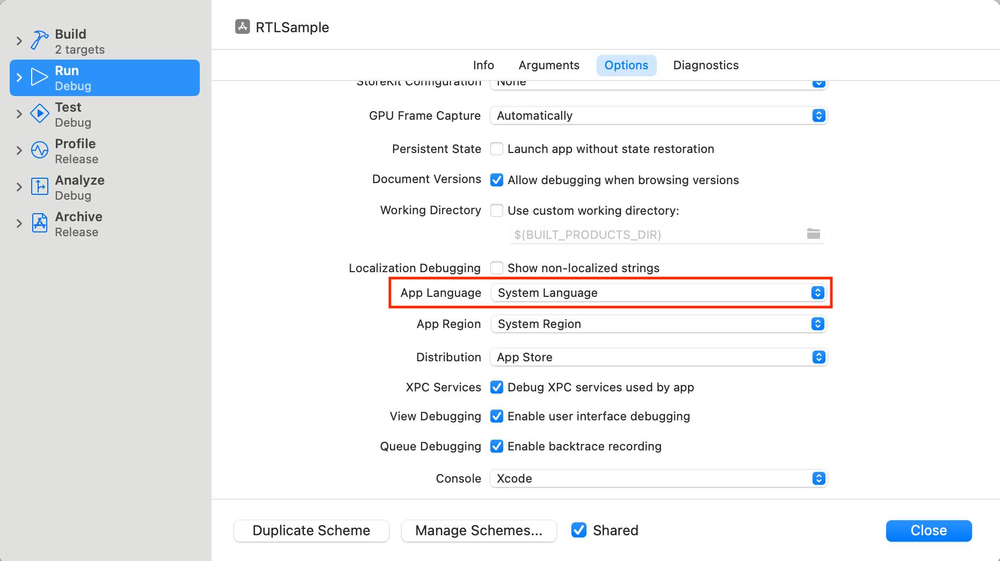
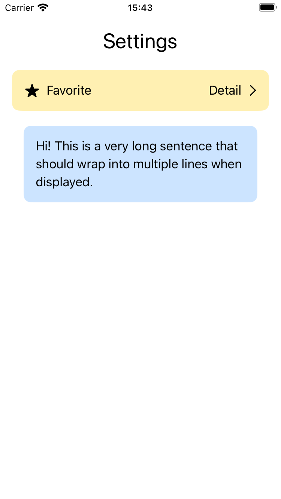
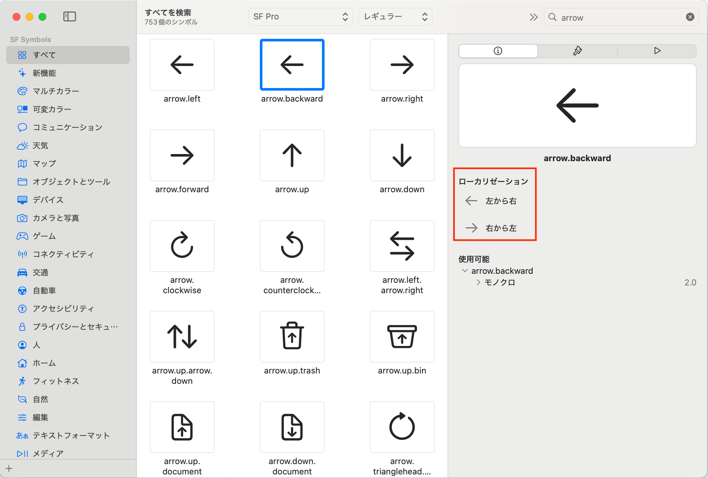
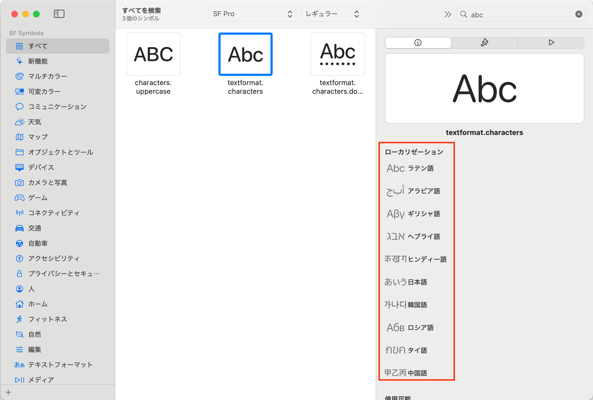
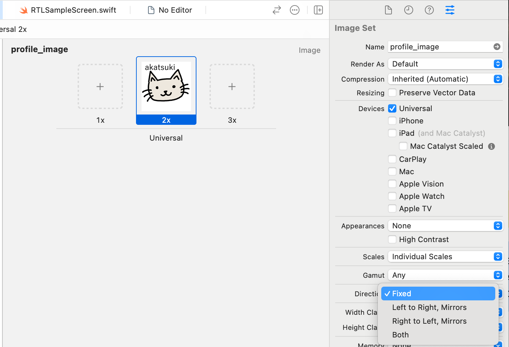

  
iOS アプリで RTL 言語対応をする（画像編）

  
akatsuki174

# iOS アプリで RTL 言語対応をする（画像編）

前回のゆめみ大技林では Android アプリにおける画像の RTL 対応について紹介しました。今度は iOS について紹介したいと思います。

iOS アプリでアラビア語などの RTL（Right to Left / 右から左）記述法を使用する言語（以降、RTL 言語とする）に対応する場合、文字列だけでなくレイアウトも RTL 用に変わることになります。とはいえ大部分は OS やフレームワーク側が自動で対応してくれます。試しにシステム言語を英語にした場合、アラビア語にした場合のスクショを並べてみました。私が特に何も手を加えずともこれだけ自動対応されます。

| 英語環境 | アラビア語環境 |
| :-- | :-- |
| {width=170} | {width=170} |

ちょっと手強いのが画像です。方向性のある一部の画像は RTL 言語用として変更するのが適切です。Human Interface Guidelines や Material Design 3 などの公式ドキュメントにその記述があります。

- インターフェイスアイコン - Human Interface Guidelines[^human_interface_guidelines_interface-icons]
- Icons and symbols - Material Design 3[^icons_and_symbols]

SF Symbols を使っている場合は UI 言語に応じて自動で反転しますが、その他のケースでは自動対応されません。ということで自動で行われる RTL 対応 / 手動でやるべき RTL 対応について書きたいと思います。

[^human_interface_guidelines_interface-icons]: インターフェイスアイコン - Human Interface Guidelines https://developer.apple.com/jp/design/human-interface-guidelines/right-to-left#Interface-icons
[^icons_and_symbols]: Icons and symbols - Material Design 3 https://m3.material.io/foundations/layout/understanding-layout/bidirectionality-rtl

## 前提

「ここに書かれていることを手元で真似して、システム言語をアラビア語にして動かしてみよう」と思ってやってみても、自動で RTL レイアウトにならないことがあります。既存言語のコピペでいいので対象の RTL 言語の翻訳ファイルを入れるか、次に説明する方法で起動オプションをいじってください。

### 実行時にアプリの言語を変更する

スキームエディタには App Language の項目があり、RTL 言語を選択したり、Pseudolanguage、つまり架空言語を選択したりできます。これを使うとアプリ外の言語はいつも使っている言語のままにできるし、アプリに RTL 言語が入ってなくてもテストできるので便利です。

{width=400}

App Language をクリックするといろいろな言語の選択肢が出てきます。アラビア語と英語が System Language のすぐ下に出てきているのは、このサンプルアプリに入っている言語がアラビア語と英語だからだと思います。注目すべきなのはさらにその下です。架空言語が5つ並んでいます。このうち、RTL に関するものは枠で囲った2つです。Right-to-Left Pseudolanguage を例にとって説明すると、文字列はそのままに、UI のレイアウト方向だけ RTL にしてくれるというものです。

{width=400}

試しにサンプルアプリを実行してみると次の結果になります。端末のシステム言語が英語の状態で実行しています。Right-to-Left Pseudolanguage を指定すると、文字列は英語のままですが、レイアウトが自動で RTL 対応されています。普段読み慣れた言語でレイアウトミスを探せるので結構便利です。

| 通常ビルド | Right-to-Left Pseudolanguage 指定 |
| :-- | :-- |
| {width=170} | {width=170} |

## 自動で行われる RTL 対応

SF Symbols を使っていれば UI 言語に合わせて自動で反転対応してくれます。SF Symbols の Mac アプリを見てみましょう。arrow.backward というアイコンは、左から右のレイアウト（ LTR ）の時は矢印が左を向いている状態、右から左のレイアウト（ RTL ）の時は右を向いている状態に自動で変わってくれることがわかります。

{width=400}

なんなら RTL か LTR かだけでなく何語かによっても表示が変わるので、多言語対応の参考になります。

{width=400}

ちなみに矢印に関しては同じ方向を向いたアイコンが2つあります。 arrow.left は RTL 言語でも LTR 言語でも常に左向きです。名前に left がついているのでなんとなく想像がつくと思います。一方もう一つの矢印は arrow.backward という名前で、 RTL 言語か LTR 言語かによって指す方向が異なります。
自分の用途に合わせてどちらがいいか選定してください。

{width=400}

## 手動でやるべき RTL 対応

RTL と LTR で異なるものを表示したい場合は Asset Catalog に両方の画像を入れるのが一般的な対応方法です。 Asset Catalog の右メニューから Direction という項目を探します。デフォルトは Fixed になっていると思います。これは UI 言語に関係なく、常に画像が同じであることを表します。

{width=400}

プルダウンをクリックすると Fixed の他に3つの選択肢が出てきます。末尾に Mirrors がついている2つは、アルゴリズムを元にミラーリングしたい場合に設定します。例えば　Left to Right, Mirrors　を指定した場合は「この画像は　LTR　を基準に作っていて、　RTL　言語になったら自動的に左右反転してね」という意味になります。最後の　Both　では、単純に左右反転しただけでは対応できない画像に対して、　LTR　用　RTL　用両方の画像を登録できます。

{width=400}

Both を選択するとこのように両方の画像を設定できるようになりました。

{width=400}

## 最後に

今回は iOS アプリを RTL 言語対応する時に発生する画像周りの処理について書いてみました。前回の Android の場合に比べるとわりとすんなり対応できるかなという印象です。

今回の話は公式情報で言うと WWDC22 の Get it right (to left)[^get_it_right_to_left] にて話されているので、ぜひちらも参考にしてみてください。

[^get_it_right_to_left]: Get it right (to left) https://developer.apple.com/jp/videos/play/wwdc2022/10107/
