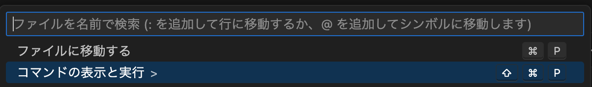
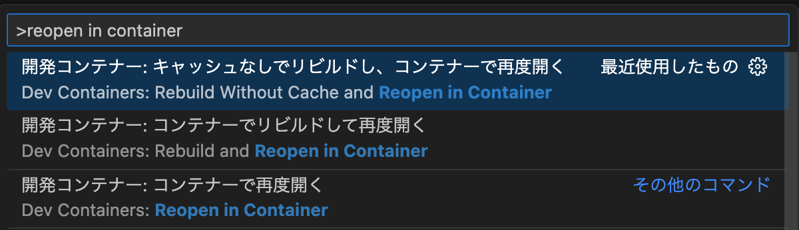
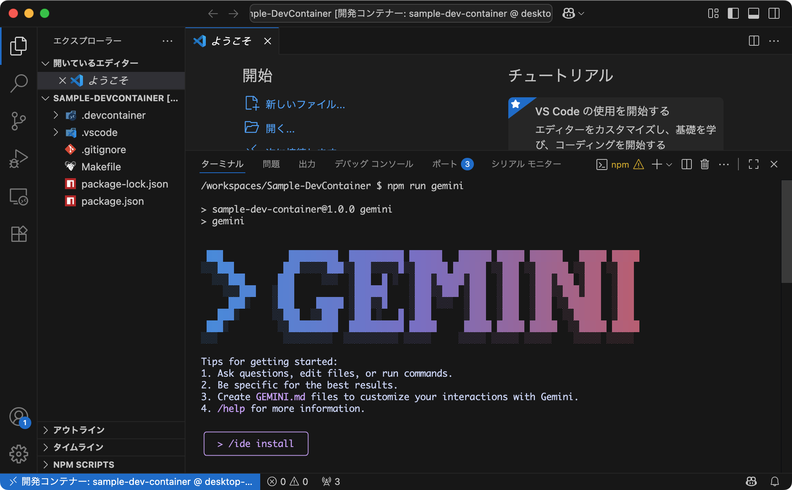

<div class="doc-header">
  <div class="doc-title">VS Code + DevContainer を利用して、CLI ツールの開発環境をチームで揃える</div>
  <div class="doc-author">江本光晴</div>
</div>

# VS Code + DevContainer を利用して、CLI ツールの開発環境をチームで揃える

近年の開発において、AI は欠かせないツールの１つです。一般的に IDE やエディタに組み込まれた AI 機能を利用するのが望ましいですが、それをサポートしていない場合には CLI を使うことになるでしょう。

現在、多くの AI サービスが CLI を提供しています。それらのドキュメントを確認すると、多くの場合で、グローバルインストールが推奨されています。

```shell
npm install -g @google/gemini-cli
```

ここで利用している npm は Node.js のパッケージマネージャーです。Node.js の詳細説明は割愛しますが、オプション `-g` によるグローバルインストールを行うと、どのディレクトリからでもコマンドを実行でき、便利です。しかしながら、チーム開発において、いくつかの問題が潜んでいます。

|問題|詳細|
|:--|:--|
| <span class="no-break">バージョンの不一致</span> | メンバーそれぞれでバージョンが異なると、機能や挙動などが保証できない |
| <span class="no-break">設定の共有が困難</span> | MCP（Model Context Protocol）やカスタムプロンプトなど、チームメンバーやプロジェクト間で設定を揃えるのが難しい |
| <span class="no-break">環境再構築の手間</span> | Node.js をインストールしたり、更新するたびに、環境の再構築が必要になる |

この記事は、これらの問題に取り組みます。チーム間で同じ開発環境を維持するためのアプローチとして、Visual Studio Code（以降、VS Code）+ DevContainer を活用する方法を紹介します。なお、開発環境は macOS を対象として、CLI の例には Gemini CLI を利用します。

## グローバルからローカルにインストールする

CLI ツールをグローバルにインストールするのではなく、プロジェクト自体にインストールします。プロジェクトに `package.json` がなければ、`npm init` で作成します。

```shell
npm install --save-dev @google/gemini-cli
```

ここで `@google/gemini-cli` は開発中のみの利用なので、devDependencies にインストールしました。たとえば、`package.json` は次のようになります。

```json
{
  "name": "sample-dev",
  "version": "1.0.0",
  "scripts": {
    "gemini": "gemini"
  },
  "devDependencies": {
    "@google/gemini-cli": "0.1.20"
  }
}
```

これにより `npm install` を実行するだけで、このプロジェクトを利用する全員に、同じバージョンの CLI ツールがインストールされます。実行は `npm run gemini` のように npm script 経由で行います。

## Node.js から VS Code + DevContainer へ

前節でグローバルインストールの問題は解決しました。しかし、まだ問題は残っています。Node.js を各自環境でインストールしないといけません。エンジニアすべてが Node.js に詳しいわけではありません。環境構築だけで時間を消費してしまいます。

それを解決するのが VS Code + DevContainer です。DevContainer は、VS Code において、開発環境そのものを Docker コンテナとして構築して、その仮想環境にマウントできます。そのコンテナの環境設定はテキストファイルで記述できるので、チームで簡単に共有できます。

これにより、開発者は手元のマシンに VS Code と Docker さえあれば、誰でも同じ開発環境を再現できます。Node.js のインストールや CLI ツールの導入もすべてコンテナが担うため、個別の環境構築は不要になります。

ただし注意点として、あくまで VS Code 上での利用となるため、普段の開発に利用する IDE やエディタとは異なる場合があります。私自身も Xcode と VS Code を併用して、開発しています。

### DevContainer の環境を構築する

まず、VS Code の拡張機能 Dev Containers [^devContainers] をインストールしてください。そして、プロジェクトのルートにディレクトリ `.devcontainer` を作成して、その中に次の２つのファイルを作成します。

[^devContainers]: Dev Containers - Visual Studio Marketplace, https://marketplace.visualstudio.com/items?itemName=ms-vscode-remote.remote-containers

| ファイル | 役割 |
| :-- | :-- |
| <span class="no-break">Dockerfile</span> | 開発環境で利用する Docker イメージを定義するファイル。ベースイメージの指定、必要なライブラリやパッケージのインストール、環境変数の設定などを記述する。|
| <span class="no-break">devcontainer.json</span> | DevContainer の 設定ファイル。利用する Dockerfile やイメージの指定、拡張機能のインストール、エディタの設定、マウントするボリューム、ポートフォワーディングなどを管理する。VS Code がこのファイルを読み取り、コンテナ環境を起動・接続する。 |

たとえば、`Dockerfile` を次のように記述します。ここでは Node.js v24 がインストールされたコンテナイメージを定義しています。ローカル環境で作成した `package.json` を利用します。そして、`npm install` を実行することで、Gemini CLI をインストールします。

```dockerfile
FROM node:24-alpine
COPY ./package*.json ./
RUN npm install
WORKDIR /workspace
```

次に `devcontainer.json` です。先ほど作成した Dockerfile を指定したり、コンテナが起動したときに自動でインストールされる VS Code 拡張機能（`google.gemini-code-assist` など）を指定します。

```json
{
 "name": "sample-dev-container",
 "build": {
  "dockerfile": "./Dockerfile",
  "context": ".."
 },
 "remoteUser": "node",
 "customizations": {
  "vscode": {
   "extensions": [
    "google.gemini-code-assist"
   ]
  }
 }
}
```

これらファイルを含んだ VS Code + DevContainer で Gemini CLI を実行するサンプルプロジェクトを GitHub に公開しました。

```url
https://github.com/mitsuharu/Sample-DevContainer
```

ここで、Docker の準備は Docker Desktop をインストールするだけです。しかしながら、諸事情で Docker Desktop をインストールされない方もいるでしょう。その場合、OSS としての Docker と、その Docker コンテナを管理する Colima [^colima] を組み合わせて利用する方法もあります。

その Docker + Colima を利用する環境の構築や利用は、サンプルプロジェクトに追加しています。定義された Makefile から `make setup-docker` を実行すれば、必要なツールがインストールされます。詳しくはリポジトリの README や Makefile を確認してください。

[^colima]: https://github.com/abiosoft/colima

### DevContainer を起動する

Dockerfile などの準備が終わったら、次の手順で DevContainer を起動します。

1. プロジェクトを VS Code で開く
1. VS Code で「コマンドの表示と実行」から選択する
  
1. コマンドからコンテナを開く
  
1. コンテナのビルドが完了すると、コンテナに接続された状態で VS Code が起動する

これでコンテナは起動しました。VS Code のコンテナにマウントしたターミナルから `npm run gemini` コマンドで Gemini CLI が起動します。



## まとめ

CLI ツールをグローバルにインストールする方法は手軽ですが、チーム開発では環境の不整合という大きな問題が起こります。私は、プロジェクトに梱包する形として、ローカルインストールする方法を推奨します。

さらに VS Code + DevContainer を利用すれば、開発環境イメージを共有できます。AI ツールに限らず、チーム全員が同じ開発環境を維持するのは難しいです。この DevContainer を利用すれば、開発以外のトラブルから解放されます。エンジニアそれぞれが Node.js を準備する必要はなくなります。

ただし、この DevContainer をメンテナンスする人は、ローカル環境に Node.js をインストールしておくと便利ですね。問題が起こったときに、原因が Docker か Node.js かと切り分けたり、ちょっとした動作確認をする際に、手早く手元で調査できます。

改めて、この VS Code + DevContainer で Gemini CLI を実行するサンプルプロジェクトを GitHub に公開しています。ご興味ある方はご覧ください。

```url
https://github.com/mitsuharu/Sample-DevContainer
```
