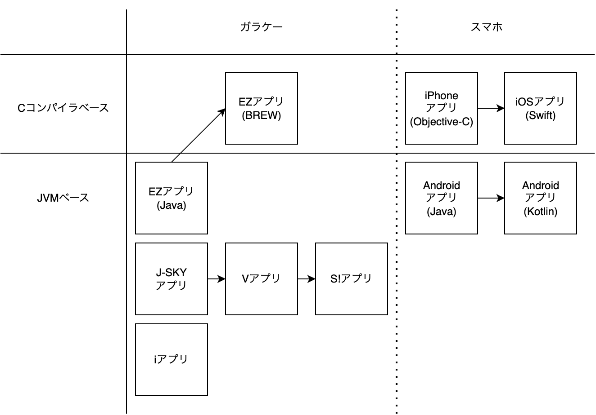
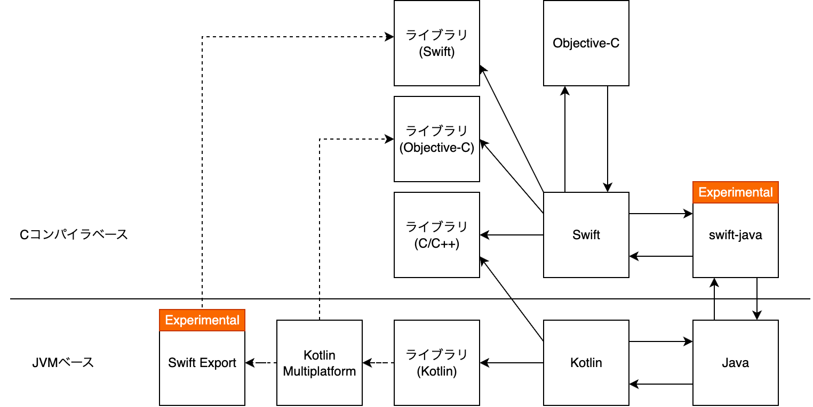

<div class="doc-header">
  <h1>モバイルアプリのこれから</h1>
  <div class="doc-author">川島慶之</div>
</div>

 モバイルアプリのこれから
==

## はじめに

筆者は2004年からモバイルアプリ開発に関わってきました。これまでの歴史を振り返って、この二十年ほどで変わったものと変わらなかったものを見ていき、モバイルアプリのこれからを考えてみます。

最初に結論として、モバイルアプリのこれからについて現在の筆者の考えとしては、**アプリレスアプリ**を構想しています。アプリを開いて何かをする体験ではなく、何かしたいことがあって、アプリの機能を利用する形をイメージしています。

この背景についてはFindyさん企画の『テック転生』<span class="footnote">「もしもいま記憶喪失になりテックをイチから学び直すとしたら、どんな風に勉強しますか？」IFストーリーを通じて、それぞれの方の技術との向き合い方を聞いている企画です。 https://findy-code.io/engineer-lab/archive/category/%E3%83%86%E3%83%83%E3%82%AF%E8%BB%A2%E7%94%9F</span>に「もしもいま記憶喪失になりモバイルアプリ開発を学び直すとしたら」というテーマで寄稿もしています。


寄稿した記事では、コードの詳細に触れていなかったので、この記事では、コードを中心に見て行きます。

## モバイルアプリの変遷

モバイルアプリのコードベースは大きく二つに分類されます。CコンパイラベースとJVM<span class="footnote">Java仮想マシン（Java Virtual Machine）上で動作する環境を指しています。プログラミング言語としては、Java、Kotlin、Scalaなどあります。</span>ベースです<span class="footnote">これらはモバイルアプリの中でもネイティブと呼ばれ、携帯電話のプラットフォームをラップせずに直接利用することから、後述のプラットフォームごとの言語体系の対比として、そう呼ばれています。ネイティブではないものとしては、WebベースのjQuery Mobile、Cordova、Ionic、React Native、.NET環境のXamarin、DartVMのFlutter 等多数存在しますが、これらはプラットフォームをラップしていて、今回の記事の対象外としました。単純に、これらの方面に対して、筆者の経験が乏しいのも理由の一つです。</span>。ここでは、Cコンパイラベースをネイティブコードに直接コンパイルする系統、JVMベースを仮想マシン上で動作する系統として整理しています。

{width="360"}

基本的にガラケーの頃はJVMベースのJavaアプリが主流でした。EZアプリ<span class="footnote">EZアプリはJVMベースのJavaアプリとCコンパイラベースのBREWアプリがあります。</span>のみ、途中からCコンパイラベースに変わりました。携帯電話に特化したプロファイルとしてCLDC／MIDPに準拠しており、iアプリのみCLDCの独自拡張のプロファイル・DoJaを採用していました<span class="footnote">参考文献のJava言語によるモバイルゲーム開発 p.3〜4に詳しい理由が記されています。抜粋すると、当時iアプリの市場投入が早かったため、MIDPが標準化される前のタイミングでCLDCに準拠することになりました。</span>。その後、スマートフォンが登場して、Cコンパイラベースの iPhoneとJVMベースのAndroid<span class="footnote">Androidでは、Javaだけでなく、NDKを利用してC／C++のライブラリを組み込むことも可能です。相互運用については後述します。</span> が登場して、今も続いています。

本記事で扱うコードについて、`import` やオーバーライドメソッドが必須になる部分がありますが、紙面では冗長な情報になるため、全体的に文脈と無関係な文は省略しています。現状、ビルド可能なリソース自体入手困難だと思うので検証も難しいですが、本記事で紹介しているコードはそのままではコンパイルが通らないことをご了承ください。

それでは、画面に「Hello, World!」と出力するアプリを通してこれまでのモバイルアプリの変遷を見ていきます。

### iアプリ

`IApplication` を継承したクラスの `start` メソッドがアプリ起動時に呼ばれます。`Canvas` を継承したクラスの `paint` メソッドがシステムから定期的に呼ばれます。画面に表示したい処理をこの `paint` メソッドに記述することでアプリを表現していました。下記に示すように `Canvas` に直接グラフィックスを描画して、画面に表示していました。これは今もiPhone／Androidで直接座標を指定して描画する仕組み自体は残っています。

```java
public class MyApp extends IApplication {
    // 起動時に呼ばれる
    public void start() {
        // Canvasを継承したクラスのインスタンスを
        // ディスプレイにセットすることで画面に描画される
        Display.setCurrent(new ContentView());
    }
}

class ContentView extends Canvas {
    // システムから必要に応じて呼ばれる
    public void paint(Graphics g) {
        g.drawString("Hello, World!", 0, 0);
    }
}
```

インタラクティブな描画が必要な時は、スレッドを用意して描画と処理を無限に繰り返すメインループで行っていました。コード中の例外処理は基本無視というのは、ここで `catch` してもアプリの処理を復帰するのは現実的ではなかったため、諦めとしての無視になっています。当時は、アプリサイズに制約があり、軽量化のために、クラスの `import` も最小限にし、通常なら `InterruptedException` を `catch` すべきですが、形式的なものなので上位クラスである `Exception` に丸めていたりしました。

```java
public class MyApp extends IApplication {
    // 起動時に呼ばれる
    public void start() {
        // Canvasを継承したクラスのインスタンスを
        // ディスプレイにセットすることで画面に描画される
        ContentView v = new ContentView();
        Display.setCurrent(v);
        // インタラクティブな処理のためにスレッドを開始する
        new Thread(v).start();
    }
}

// Runnable を継承してスレッド処理可能にします
class ContentView extends Canvas implements Runnable {
    public void run() {
        // メインループ
        while (true) {
            int keyEvent = getKeypadState();
            // キーイベント処理
            // ...

            // バッファリング
            g.lock();
            // 描画処理
            // ...
            g.unlock(true);

            // メインループでシステムをブロックしないようにスリープを入れる
            try {
                Thread.sleep(100);
            } catch (Exception e) {
                // 例外処理は基本的に無視
            }
        }
    }
    // システムから必要に応じて呼ばれるがスレッド処理するのでここでは何もしない
    public void paint(Graphics g) {
    }
}
```

### EZアプリ（Java）／J-Skyアプリ／Vアプリ／S!アプリ

iアプリが独自拡張しているDoJaとはAPIが多少異なる程度で、大きな差異はないです<span class="footnote">厳密には、DoJaはCLDCの独自拡張で、MIDPとの間に互換性はありません。共通している部分は多々あるため結果的に共通利用できる部分は多いです。</span>。EZアプリのJava版とJ-Skyアプリ／Vアプリ／S!アプリ<span class="footnote">アプリの呼び名が変わっているのは、買収や統合を経て会社組織が変わり、それに伴いアプリ名も変わっていきました。J-SkyアプリはVodafoneに統合されVアプリに、VアプリはSoftBankに買収されS!アプリに、アプリの呼び名は変わっていますが、仕様は継続的に維持され発展しているため本質的な違いはありません。これらは、MIDPを拡張した仕様JSCL／MEXAを採用しています。</span>はこの形になります。

継承するクラスが `MIDlet` に変わって、エントリ・ポイントとしてはコンストラクタ<span class="footnote">Javaではクラスと同名の、ここでは `MyApp()` がコンストラクタと呼ばれ、クラスのインスタンスを生成するための特別な関数になります。システム側で `MyApp` のインスタンスを生成する際に、このコンストラクタが呼ばれるため、ここがエントリ・ポイントとして機能します。</span>になりました。`Canvas`を介して直接描画する点は同じです。インタラクティブな描画に関してもiアプリと同様のためここでは省略します。

```java
public class MyApp extends MIDlet {
    // 起動時に呼ばれる
    public MyApp() {
        Display.getDisplay(this).setCurrent(new ContentView());
    }
}

class ContentView extends Canvas {
    // システムから必要に応じて呼ばれる
    public void paint(Graphics g) {
        g.drawString("Hello, World!", 0, 0, Graphics.LEFT | Graphics.TOP);
    }
}
```

### EZアプリ（BREW）

Javaと見比べるとSDKではなく、プログラムとして記述が必要な範囲が広いです。まずエントリ・ポイントでBREWアプリの実態となる `AEEApplet` に対してメモリを割り当てます。システム側からイベントハンドラが定期的に呼ばれ、イベントハンドラの中ではディスプレイへの参照を示す `pIDisplay` に対してテキストの描画を指示して、画面にテキストが表示される流れになっています。筆者自身は当時BREWアプリの開発に関わったことはなく、書籍と現存するサンプルリポジトリ<span class="footnote">Software Development for the QUALCOMM BREW Platform https://github.com/Apress/software-dev-for-qualcomm-brew-platform</span>を参考に、当時の実装構造を再現しています。

```c
// イベントハンドラの定義
static boolean HelloWorld_HandleEvent( IApplet * pi,
                                       AEEEvent eCode,
                                       uint16 wParam,
                                       uint32 dwParam );

// エントリ・ポイント
int AEEClsCreateInstance( AEECLSID clsID,
                          IShell * pIShell,
                          IModule * po,
                          void ** ppObj )
{
    boolean result = FALSE;
    *ppObj = NULL;
    if ( clsID == AEECLSID_HELLOWORLD )
    {
        // アプリのメモリ割り当て
        result = AEEApplet_New( sizeof(AEEApplet),
                                clsID,
                                pIShell,
                                po,
                                (IApplet**)ppObj,
                                (AEEHANDLER)HelloWorld_HandleEvent,
                                NULL);
    }
    return result ? AEE_SUCCESS : EFAILED;
}

/**
 * イベントハンドラ
 */
static boolean HelloWorld_HandleEvent( IApplet * pi,
                                       AEEEvent eCode,
                                       uint16 wParam,
                                       uint32 dwParam )
{
    AECHAR szText[] = {'H','e','l','l','o',',',' ',
                       'W','o','r','l','d','!','\0'};
    AEEApplet * pMe = (AEEApplet*)pi;
    boolean handled = FALSE;
    switch (eCode)
    {
        case EVT_APP_START:
            IDISPLAY_ClearScreen( pMe->pIDisplay );
            // テキスト描画
            IDISPLAY_DrawText( pMe->pIDisplay,
                               AEE_FONT_BOLD,
                               szText,
                               -1, 0, 0, 0,
                              IDF_ALIGN_CENTER | IDF_ALIGN_MIDDLE );
            IDISPLAY_Update( pMe->pIDisplay );
            handled = TRUE;
            break;
        case EVT_APP_STOP:
            handled = TRUE;
            break;
        default:
            break;
    }
    return handled;
}
```

### Android（Java）

Androidでは、`Activity` を継承して `onCreated` が起動時に呼ばれます。JVMベースの後継として考え方に大きな違いはありません。ただし、画面回転の概念が誕生したため、`savedInstanceState` のように状態を保存する必要性が生じました。大きな違いとして、プログラムとレイアウトファイルが分かれるようになりました。デバイス側でサポートするアプリサイズが飛躍的に増加して<span class="footnote">ガラケー時代は、10〜100KB制限ほどでしたが、デバイスのストレージに比例して数MBまで可能になりました。`import` するクラスを制限して軽量化する制約からも解放されました。</span>、ファイルを分割するのが当たり前になりました。これまでと同じように `Canvas` を利用して座標に直接描画する方法も可能ではあります。

```java
public class MainActivity extends Activity {
    // 起動時に呼ばれる
    @Override
    public void onCreate(Bundle savedInstanceState) {
        super.onCreate();
        setContentView(R.layout.main);
    }
}
```

レイアウトファイルで構造を定義します。

```xml
<?xml version="1.0" encoding="utf-8"?>
<LinearLayout xmlns:android="http://schemas.android.com/apk/res/android"
    android:orientation="vertical"
    android:layout_width="fill_parent"
    android:layout_height="fill_parent"
    >
    <TextView
        android:layout_width="fill_parent"
        android:layout_height="wrap_content"
        android:text="@string/hello_world"
    />
</LinearLayout>
```

テキストリソースファイルを利用することで多言語対応もサポートするようになりました。これまでのガラケーは日本向けに限定されていましたが、世界中のユーザが対象になり、それをサポートできる仕組みが用意されています。

```xml
<?xml version="1.0" encoding="utf-8"?>
<resources>
    <string name="hello_world">Hello, World!</string>
</resources>
```

これらXMLファイルは `R.java` に変換されてプログラムからそれぞれ `R.layout.main` `R.string.hello_world` という形でアクセス可能になっています。

### iPhone OS（Objective-C）

ここまで紹介してきたガラケーやAndroidアプリはいずれもJavaアプリだったので似たような構成でしたが、iPhone OS<span class="footnote">初期はiOSではなく、iPhone OSと呼ばれていました。</span>はそれとは異なるC系統の構成に変わります。唯一、BREWアプリだけ特異点で、Objective-Cも同じCコンパラベースのため、近いものを感じます。Objective-Cは名前に**C**と付いている通り、C言語のスタイルを踏襲しています。そのため、`main` 関数から始まります。

```objc
// 起動時に呼ばれます
int main(int argc, char *argv[]) {
    NSAutoreleasePool * pool = [[NSAutoreleasePool alloc] init];
    int retVal = UIApplicationMain(argc, argv, nil, @"MyApp");
    [pool release];
    return retVal;
}
```

ヘッダファイルと実装ファイルが必要になっています。BREWアプリでもあったように予めメモリを確保するために宣言が必要になります。

```objc

@class MainViewController;

@interface MyApp : NSObject <UIApplicationDelegate> {
    UIWindow *window;
    MainViewController *viewController;
}

@property (nonatomic, retain) IBOutlet UIWindow *window;
@property (nonatomic, retain) IBOutlet MainViewController *viewController;

@end
```

OSとしてアプリの起動が完了すると `applicationDidFinishLaunching` が呼ばれて、ここで画面表示の処理を行います。後述のViewControllerを生成して処理を委譲します。

```objc
@implementation MyApp

@synthesize window;
@synthesize viewController;

- (void)applicationDidFinishLaunching:(UIApplication *)application {
    window = [[UIWindow alloc] initWithFrame:[[UIScreen mainScreen] bounds]];
    viewController = [[MyViewController alloc] init];

    [window addSubview:viewController.view];
    [window makeKeyAndVisible];
}

- (void)dealloc {
    [viewController release];
    [window release];
    [super dealloc];
}
@end
```

ViewControllerという考えがモバイルアプリに登場して、Model-View-ControllerのMVCアーキテクチャがここから普及していきます。`UITextView` は、別のGUIツール<span class="footnote">Storyboard https://developer.apple.com/library/archive/documentation/General/Conceptual/Devpedia-CocoaApp/Storyboard.html</span>で用意したUIコンポーネントでプログラム側でその参照を持ち後述のViewControllerの実装で任意の文字列を割り当てて画面にテキストを表示できるようにしています。

```objc
@interface MainViewController : UIViewController {
    UITextView *textView;
}
@end
```

`loadView` の中で `textView.text` に文字列を指定し、画面に「Hello, World!」が表示されます。

```objc
@implementation MainViewController

- (id)init {
    return [super init];
}

- (void)loadView {
    textView = [[UITextView alloc] initWithFrame:[[UIScreen mainScreen] bounds]];
    textView.text = @"Hello, World!";
    self.view = textView;
}

- (void)dealloc {
    [textView release];
    [super dealloc];
}
@end
```

### iOS（Swift）

Objective-CからSwiftに変わり、iPhone OSもiOSと呼ばれるようになり、より洗練されていきました。その間の変遷は本記事では省略してSwiftUIの表現まで一気に時代を進めます。Objective-Cから比べるとかなりシンプルになりました。プログラムとして描画命令の考えから、宣言的なUI表現へと変わっていきました。同じC系でもメモリ管理についてはプログラムで明示しなくても良くなっていきました。Previewも宣言的に書けるようになりました。このコードの例では一つのプレビューですが、状態によって表示が変わる場合など複数の条件のプレビューを定義することもできます。

```swift
@main
struct MyApp: App {
  var body: some Scene {
    WindowGroup {
      ContentView()
    }
  }
}

struct ContentView: View {
  var body: some View {
    VStack {
      Text("Hello, World!")
    }
  }
}

#Preview {
  ContentView()
}
```

### Android（Kotlin）

Androidの方も開発言語がJavaからKotlinに変わり、Android OSの表現力も洗練されていきました。その間の変遷についても本記事では省略してJetpack Composeの表現まで一気に進めます。宣言的なUI表現へと変わりました。SwiftUI同様にプレビューも宣言的に定義できます。

```kotlin
class MainActivity : ComponentActivity() {
  override fun onCreate(savedInstanceState: Bundle?) {
    super.onCreate(savedInstanceState)
    setContent {
      ContentView()
    }
  }
}

@Composable
fun ContentView() {
  Text("Hello, World!")
}

@Preview
@Composable
fun ContentViewPreview() {
  ContentView()
}
```

### iOS（App Intent）

まだ広く普及はしていないですが、筆者が次のアプリの形として、Appleが提供するApp Intent<span class="footnote">https://developer.apple.com/documentation/AppIntents</span>の仕組みに可能性を感じています。 直接アプリを開いて操作するのではなく、特定の要求に対してアプリ側が反応して処理をすることも可能になっています。Alexa<span class="footnote">Amazonのスマートスピーカー。音声を通してさまざまなことができます。 https://www.amazon.co.jp/meet-alexa</span>が登場した時に音声だけで操作できるならデバイスは不要になるかもと思いましたが、一気には変わりませんでした。筆者にとってのスマホの登場のように体験が一変することはなかったですが、日常に少しずつ溶け込んで変化は持続しています。App Intentでアプリを明示的に開くという体験は薄くなっていくことでしょう。その先にアプリという概念はOSに統合されて溶けていくような可能性も感じています。ここにはAIによる意図の解釈が進化を加速させると思っています。

```swift
struct MyIntent: AppIntent {
  static let title: LocalizedStringResource = "My Intent"

  @MainActor
  func perform() async throws -> some IntentResult {
    return .result()
  }
}
```

Androidには、当初からIntent<span class="footnote">明示的にアプリを指定せずに特定のアクションに対してActivityを起動させることができます。 https://developer.android.com/guide/components/intents-common</span>やBroadcast<span class="footnote">他のアプリやシステムから一斉送信されるメッセージを受け取って反応するような仕組みを作れます。  https://developer.android.com/develop/background-work/background-tasks/broadcasts</span>は存在しますが、AIやOSとの統合の観点だとまだ弱い気がしています。

## モバイルアプリの相互運用

最後に相互運用についても触れます。ここでの相互運用とは、異なる開発言語を併用して扱うことを指しています。デバイスやOSの多様化と、プログラミング言語のモダン化が進む中で、異なる言語間で既存資産を共有したり、機能を統合するための手段として相互運用の重要性は大きくなっています。特に今動いているものを動かしながらソフトウェアを書き換えていく上では必須になっています。

次の図は現在のモバイルアプリの相互運用の関係性を示しています。

{width="360"}

Androidでは初期からJNI<span class="footnote">Java Native Interface これによって、JVMで実行されるJavaコードが C、C++、アセンブリ言語など他のプログラミング言語で書かれたアプリケーションやライブラリと相互運用できるようになります。  https://docs.oracle.com/javase/jp/1.5.0/guide/jni/spec/intro.html https://developer.android.com/ndk/guides/build</span>を利用して、Cライブラリとの相互運用が可能になっていました。これにより、C言語で開発していた資産を利用できていました。スマホ初期から、iPhone／Android向けにコアのロジックをCライブラリとして共通利用する運用は行われてきました。現在はAndroidアプリの開発言語であるKotlinがKotlin Multiplatform を提供していて、Kotlin言語で開発した資産をiPhoneにも活用できるようになり、徐々に普及してきました。現時点では、図で示されるようにObjective-Cライブラリとして生成されます。執筆時点でExperimentalですが、Swift Export<span class="footnote">Kotlin MultiplatformからSwiftコードを生成し、Objective-Cヘッダーが不要になり、Swiftとして呼び出せるようになります。 Interoperability with Swift using Swift export https://kotlinlang.org/docs/native-swift-export.html</span>も進んできて、Swiftライブラリとしての利用が可能になりつつあります。一方で、Swift側からもJavaとの相互運用を実現するためのプロジェクトswift-java<span class="footnote">https://github.com/swiftlang/swift-java</span>も、Experimental段階ながら進行中です。

 <hr class="page-break" />

このテーマについては、前号の『ゆめみ大技林 '25』に「Swift と Java の相互運用」というタイトルで寄稿しています。


iPhone向けの開発言語は、当初Objective-Cでしたが、Swiftに変わる際にも相互運用が確保されていたため、段階的な移行が可能でした。これはAndroidも同じで、JavaとKotlinも同様の関係にあります。しかしここまでの歴史を振り返ると、ガラケーとスマホの間には大きな分断があります。今ある資産を活用しつつ、段階的な移行することが理想ですが、大きな変化の前では、そのプロセスすら再定義が求められるのかもしれません。

## まとめ

OSとハードウェアの進化が目覚ましく、モバイルアプリだからといって何か制限が課せられる部分がこの二十年間で非常に小さくなっていきました。メモリやスレッドを意識してプログラミングする感覚も高度に抽象化されて宣言的な表現が可能になってきました。App Intentはアプリの存在も抽象化してOSに統合できる可能性も秘めています。プログラミングそのものが抽象化の積み重ねで、今後アプリという形は抽象化される対象になっていくのではと考えています。またそれが促進するとディスプレイが必要な場面も減っていき、現在の大きく肥大化したスマートフォンの形状も形を変えていくのではと予想するのと同時に、そうしていく必要があると感じています。

<hr class="page-break" />

## 参考文献
- 鷲見豊著. プログラミングiモードJavaーiアプリの設計と開発, オライリー・ジャパン, 2001.
- 布留川英一著. iアプリゲーム開発テキストブック, 毎日コミュニケーションズ, 2005.
- 笠野英松著. BREWアドバンスト・プログラミング, 秀和システム, 2005.
- 布留川英一著. MIDP 2.0 携帯Javaアプリ開発ハンドブック, 毎日コミュニケーションズ, 2005.
- 藤田和久著. Java言語によるモバイルゲーム開発, ソフトバンククリエイティブ, 2008.
- 江川崇／藤井大助／麻野耕一／藤田泰介／山田暁通／山岡敏夫／佐野徹郎／竹端進著. Google Androidプログラミング入門、アスキー・メディアワークス, 2009. 
- ジョナサン・ジジアルスキー著, 近藤誠監訳. iPhone SDK アプリケーション開発ガイド, オライリー・ジャパン, 2009.
- SwiftUI Tutorials https://developer.apple.com/tutorials/swiftui/
- Jetpack Compose Tutorial https://developer.android.com/develop/ui/compose/tutorial
