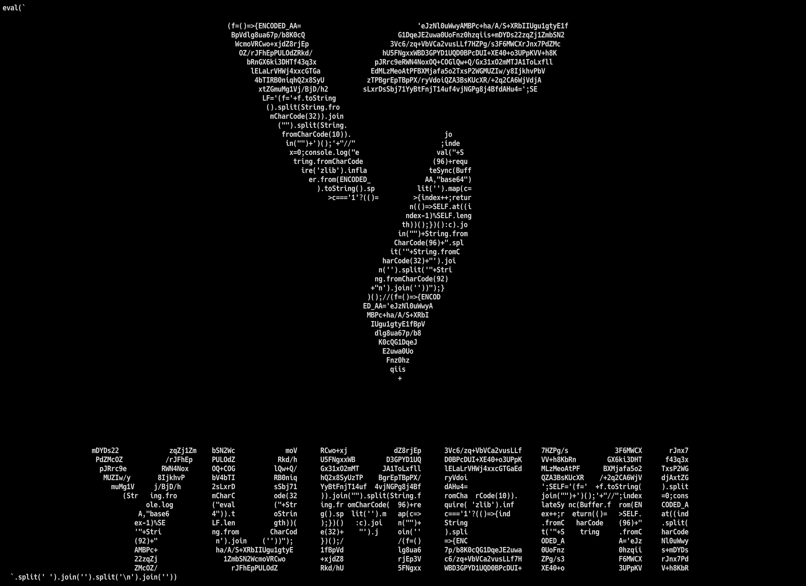
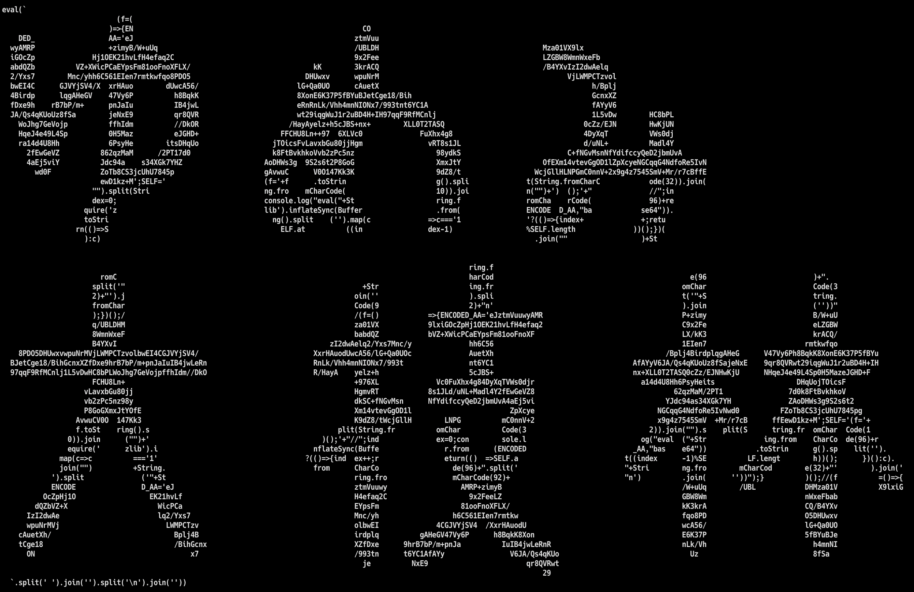

<div class="doc-header">
  <div class="doc-title">AAクワイン</div>
  <div class="doc-author">kii</div>
</div>

# AAクワイン



## はじめに

みなさんはクワインというものを聞いたことがありますか？　簡単に説明すると、実行した結果が自分自身のソースコードとなるようなプログラムのことです。冒頭に示した画像は弊社のロゴを表していますが、実はコードによる AA [^1] となっています。さらにいえば、クワインです。
もちろん、クワインがどれもこのようなものということはなく、次のような簡単なコードもあります。

```javascript
(function f () { console.log('(' + f + ')()') })()
```

このコードを実行すると、ソースコードとまったく同じの文字列が返ってくることが分かります。何度実行しても自分自身が返ってくるので面白いですね。
クワインはこれだけにあらず、さまざまな種類が存在します。

今回は、その中でも AA のクワインを題材にします。
冒頭の例のようにソースコードの見た目が何かを表しているのはなかなか不思議ですが仕組みはいたってシンプルです。
このような AA クワインをどうやって作成するのか解説していきます。
なお、ソースコードはすべて JavaScript で実装します。作成したクワインは GitHub 上で公開してあります。[^3]

今回のクワインの作成に関して shopon 様の [JavaScriptでAA Quine入門](https://shoponpon.hatenablog.com/entry/2019/12/01/121046) [^2] という記事を大変参考にさせていただきました。

[^1]: AA とはアスキーアートのことであり、文字のみを使って絵や図形を表現したもの。
[^2]: shopon, "JavaScriptでAA Quine入門", <https://shoponpon.hatenablog.com/entry/2019/12/01/121046>
[^3]: <https://github.com/kii310/yumemi_quine>

## AAクワインの仕組み
AA クワインはいくつかのパートを組み合わせて作成されています。

- 元となる AA を圧縮した部分
- ソースコード全体を文字列化する部分
- 文字列化したソースコードを AA にマッピングする部分
- クワインとなったソースコードを出力する部分

主に４つのパートで構成されています。
実際にクワインを生成したコードと共に見ていきましょう（正確には変数を展開しているため少し異なる）。

```javascript
(f = () => {
  ENCODED_AA = 'eJzNl0uWwyAMBPc+ha/A/S+XRbIIUgu1gtyE1fBpVdlg8ua67p/b8K0cQG1DqeJE2uwa0UoFnz0hzqiis+mDYDs22zqZj1ZmbSN2WcmoVRCwo+xjdZ8rjEp3Vc6/zq+VbVCa2vusLLf7HZPg/s3F6MWCXrJnx7PdZMcOZ/rJFhEpPULOdZRkd/hU5FNgxxWBD3GPYD1UQD0BPcDUI+XE40+o3UPpKVV+h8KbRnGX6ki3DHTf43q3xpJRrc9eRWN4NoxOQ+COGlQw+Q/Gx31xO2mMTJA1ToLxflllELaLrVHWj4xxcGTGaEdMLzMeoAtPFBXMjafa5o2TxsP2WGMUZIw/y8IjkhvPbV4bTIRB0niqhQ2x8SyUzTPBgrEpTBpPX/ryVdoiQZA3BsKUcXR/+2q2CA6WjVdjAxtZGmuMg1Vj/BjD/h2sLxrDsSbj71YyBtFnjT14uf4vjNGPg8j4BfdAHu4=';

  SPACE = String.fromCharCode(32);
  NEW_LINE = String.fromCharCode(10);
  BACK_SLASH = String.fromCharCode(92);
  BACK_QUAT = String.fromCharCode(96);

  SELF = '(f=' + f.toString().split(SPACE).join("").split(NEW_LINE).join("") + ')();' + "//";

  index = 0;
  AA = require('zlib').inflateSync(Buffer.from(ENCODED_AA, "base64")).toString().split('').map(c => c === '1' ? (() => { index++; return (() => SELF.at((index - 1) % SELF.length))(); })() : c).join("");

  console.log("eval("+BACK_QUAT+AA+BACK_QUAT+".split('"+SPACE+"').join('').split('"+BACK_SLASH+"n').join(''))");
})();
```

### AA を圧縮


これはマッピングのために `1` と空白のみで構成された AA です。JavaScript 的に意味のある文字だと処理が大変になるため `1` で構成しています。

次に、この AA をそのままソースコードに入れたいところですが、ソースコードが AA の長さを超えると成立しないので圧縮します。
参考までに、クワインを作成するためには AA に対してクワインに変換する関数 F を適用させます。
```
Quine = F(AA)
```
すると、クワインの長さは AA より必然的に長くなる訳です。クワインを AA の形にマッピングしたいのに、その AA にコードが収まらないのならしょうがありません。そのため、 AA を圧縮してソースコードが AA に収まるようにします。

次に圧縮方法は Deflate 圧縮を使用します。それを文字列化するために Base64 変換したものを使います。
コード内では、 `ENCODED_AA` がそれに該当します。
参考までに、 `1` と空白のみで構成された AA を Deflate 圧縮し、 Base64 変換するコードを載せておきます。

```javascript
(() => {
  const AA = ''; // ここに任意の AA (1 と空白で構成されたもの)を挿入
  const ENCODED_AA = require('zlib').deflateSync(AA).toString('base64');
  console.log({ ENCODED_AA });
})();
```

### ソースコードを文字列化
次にソースコードを文字列化します。コード内では、 `SELF` の部分です。基本的に `f.toString()` で文字列化できます（このために関数に `f` という名前をつけています）。ポイントは空白と改行を除去している点と最後にコメントを挿入している点です。
AA はデザインのため空白や改行が多く含まれます。そして、コードをマッピングする際、必ずしも文法上の意味のある区切りで切れるとは限りません。そのため、ソースコードは最終的に空白と改行を除去して実行されます。
そして、 `split(" ")` としても空白は除去されてしまい、一度実行すると `split("")` となり常に同じ結果になりません。そのため、空白と改行は変数か文字コードにする必要があります。
またコメントを挿入しているのは、 AA がソースコードよりも長く、マッピング時にソースコードが一周以上してしまっても残りをコメントとして無視するためです（後で説明しますが、マッピングはソースコードを１文字ずつ繰り返し割り当てていきます）。
さらにソースコードを読むとわかりますが、 `let` や `var` の変数宣言が使われていません。最終的に空白と改行を除いた文字列に変換するため、 `let` や `var` があると `letAA='...'` となって変数名が崩れてしまうためです。一方で関数の `return` 文は `return (() => value)()` というようにサンク [^4] の即時実行にすれば空白詰めでも動作します。

[^4]: サンクとは、引数を何も受け取らず値をそのまま返す関数のこと。

### AA にマッピング
次に前節で作成した文字列化したソースコード（`SELF`）を AA にマッピングしていきます。コードでは `AA` の部分です。ざっくり解説すると、デコードした AA を１文字ずつ分解して `1` であれば文字列化したコードから１文字ずつ追加し、`1` でなければ、つまり空白であればそのまま空白を追加します。このとき、 `AA` がソースコードよりも長いとまたソースコードを繰り返しマッピングしていきます。そのため、２週目以降のソースコードが動作しないように `//` でコメント化しています。

### クワインを出力
最後にクワインとして出力します。出力する文字列は意味のある JavaScript なので `eval` で評価できるようにしておきます。空白や改行についてもソースコードを文字列化するのと同様に変数もしくは文字コードを使用します。あとは全体を `+` で繋げて `console.log()` で標準出力して完成です。
また、最後の調整としてお好みでソースコードをいじることもできます。変数を展開することでより黒魔術感がでて面白くなります。

## まとめ
AA で描くクワインはいかがでしたか。難しそうに見えるクワインも実はシンプルな方法で実現しています。みなさんもぜひクワインで遊んで見てください。


