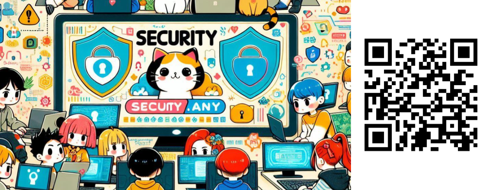

  
止められないシステムを守れ！OTセキュリティ入門

  
キタジー（kitaji0306）

# 止められないシステムを守れ！OTセキュリティ入門

## 導入 ― OTとは何か

もし、発電所がサイバー攻撃で止まったらどうなるでしょう？
電気が止まり、電車が動かず、工場のラインも全部ストップ。映画のような話ですが、これは現実に起き得るリスクです。

ここで出てくるのが **OT（Operational Technology）**。
OTとは、工場や発電所、交通システムなど、**「モノを動かす」ための技術**です。センサーやモーターを監視・制御して、社会を裏側から支えています。

一方で、私たちが普段触れているパソコンやネットのセキュリティは **ITセキュリティ**。
ITでは「機密性」「完全性」「可用性」の順に重視しますが、OTでは逆に **「止められないこと（可用性）」が最優先**。止まった瞬間に社会に影響が広がってしまうからです。

## OTシステムの特徴と課題

OTシステムにはITと違うクセがあります。

* **長生きしすぎ問題**
  工場で使われている機器は20年以上前のOSが今も現役なんてこともザラ。パッチも当てられず、脆弱性が残ったままです。

* **「ネットにつながってないから安全」神話**
  実際にはUSBの持ち込みや、便利だからとつながったVPN経由で攻撃者が入ってきます。完全に切り離すのはほぼ無理。

* **ITとOTの壁**
  「システムはIT部門、工場はOT部門」と分かれていると責任が曖昧に。セキュリティのすき間が生まれやすいのです。

## 実際に起きた攻撃事例

空想の話ではなく、世界ではすでに深刻な攻撃が起きています。

* **Stuxnet（スタックスネット）**
  USB経由でイランの核施設に侵入した有名なマルウェア。制御システムを狂わせ、機器を壊しました。

* **ウクライナ送電網攻撃**
  2015年、電力会社が攻撃されて大規模停電。まさに社会インフラが止められた例です。

* **日本でも……**
  病院や工場がランサムウェアに感染し、システム停止。診療や生産ができなくなったケースが報道されています。

## なぜ狙われるのか

攻撃者がOTを狙うのには、ちゃんと理由があります。

### 1. 社会インフラを人質にできるから

電気や水道、交通が止まれば社会全体が大混乱。攻撃のインパクトは絶大です。

### 2. お金になるから

工場が1日止まると数千万円〜数億円の損害。身代金要求には十分なネタになります。

### 3. 設備そのものが超高額

工場設備や発電システムは数十億円規模。壊れたり止まったりすると再稼働に莫大なコストがかかるので、格好のターゲット。
クラウドのITシステムと違い、簡単に複製などができないため、OTでは設備やシステムそのものを守ることが非常に重要です。

### 4. 脆弱性の宝庫

古いプロトコルや暗号化されていない通信が平気で残っていて、攻撃者にとって入りやすい環境です。
IT担当者が普段扱わない、工場特有のプロトコルも数多く存在し、防御の難しさにつながっています。

### 5. サプライチェーン攻撃

攻撃は工場そのものだけでなく、外部業者の保守作業や納入機器を経由して入り込むこともあります。
さらに、ある工場が止まれば、その部品を使う別の工場にも影響が及び、被害が波及していくのがサプライチェーン攻撃の怖さです。

## 対策の方向性

「じゃあ、どう守ればいいの？」という話。いくつか代表的な方法を紹介します。

### 1. 持込機器はちゃんとチェック

USBメモリや外部端末はルールを作ってウイルス検査を必須に。
工場はメンテナンス業者の端末やUSBメモリが頻繁に持ち込まれるので、**持ち込み前にすべて検査すること**が一定の効果を発揮します。

### 2. リスクの棚卸し

どこが一番重要で、止まったら困るのかを洗い出して優先度を決めましょう。
全方向に対策を取るのは非現実的。だからこそ、本当に守りたい機器やシステムを見極めることが大切です。

### 3. 古い機器は隔離か更新

サポート切れOSはできれば交換、それが無理ならネットワーク的に隔離。
ただし「その古いOSでしか動かない」システムも多いのが現実です。そうした場合は、対応可能なマルウェア対策ソフトを導入してリスクを下げましょう。

### 4. ネットワークを分けて監視

ITとOTを分離して、専用ファイアウォールや侵入検知システムを導入。
「つながっている前提」で監視を入れることが重要です。

### 5. 教育と訓練

IT部門とOT部門、現場の人が一緒になって演習すると効果大。
「自分の担当範囲だけ」ではなく、チーム全体で守る意識が欠かせません。

### 6. 取引先も含めて確認

サプライチェーン攻撃を防ぐには、自社だけでなく、子会社や外部業者、納入機器に対してもセキュリティ基準を求めることが必要です。
一緒に守る仕組みを作っていくことが大事です。

## まとめ ― セキュリティは社会全体を守る力

OTセキュリティは「コンピュータを守る」以上の話です。
工場、電力、交通、医療──社会そのものを守ることにつながります。

スマート工場やIoTの普及で、ITとOTの境界はますます曖昧に。セキュリティの重要性はこれからさらに高まっていくでしょう。

**あなたの身近なシステムに、見えない穴はありませんか？**
その気づきこそが、社会を守る第一歩になるのです。

## さいごに

私自身、セキュリティを専門に扱うようになってまだ日は浅いですが、セキュリティに携わっていない方にも楽しんでいただき、セキュリティを意識する第一歩にしていただけたらうれしいです。

今回の寄稿のきっかけは、趣味のコミュニティ活動でできたつながりから受けた刺激でした。そこから自分も趣味をベースにした勉強会を企画してみようと思い、この文章を書くに至りました。
この寄稿が、同じようにちょっと別のレイヤーで交流するきっかけになればうれしいです。

### そんな思いで立ち上げた**Security.any**

セキュリティという幅広い話題で初心者からベテランまで、エンジニアからリサーチャーまで、セキュリティに興味がある人、みんなが笑いながら情報交換し交流出来る場を目指しています。

### そんな思いで立ち上げた**レトロゲーから学ぶエンジニアとかマジウケる！**

ITエンジニアがレトロゲームから得た学びの『アウトプット』を通して人との『繋がり』や学ぶこと自体を『楽しむ』コミュニティです！！

