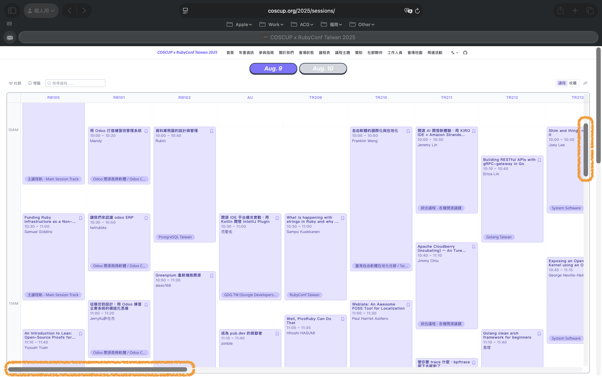
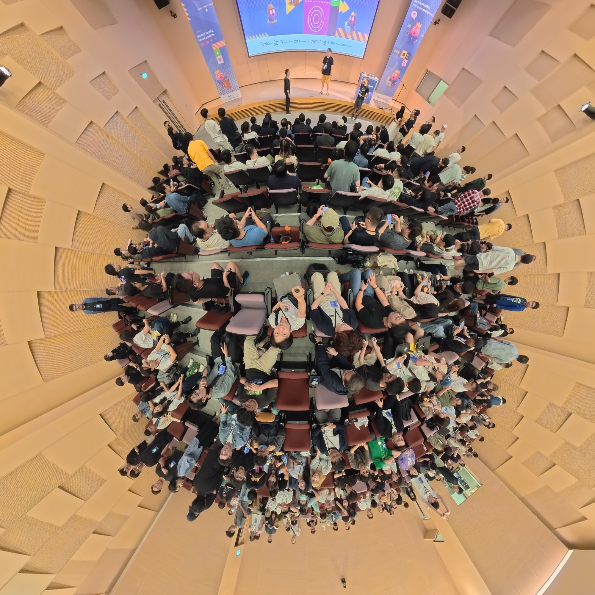

  
台湾のカンファレンスへ行ってみよう！

  
星野恵瑠

# 台湾のカンファレンスへ行ってみよう！

技術カンファレンス、それはエンジニアにとっての一大イベントです。新しい技術を学び、同じ興味を持つ人々と交流し、インスピレーションを得る場として、多くのエンジニアが楽しみにしています。

ところが、もしかしたら「海外のカンファレンスにも興味あるが、ちょっとハードルが高そう…」と思う方もたくさんいるかもしれません。言語の壁、文化の違い、そして何よりも「行くのが大変そう」というイメージがありますよね。

そんなあなたにぜひお勧めしたいのが、台湾のカンファレンスです！

## なぜ台湾なのか？

### 台湾は言葉の壁が低い

まずはなんと言っても、言葉の壁が比較的に低い！台湾は日本と同じ漢字文化圏であり、街中では至る所が日本人が馴染み深い漢字で溢れています。これだけでも、たとえばどこかに行きたい時、漢字読むだけでなんとかなる場面が多いです。この点は韓国と比べて大きなアドバンテージではないかと思います。

また台湾では歴史的経緯もあり、日本語がある程度話せる人も比較的に多いです。もちろん完璧にこなせる人は限られていますが、日本語のカタコトと漢字だけで、意外となんとかなることが多いです。

### 交通の便が良い

次に、台湾は地理的に日本から近く、また飛行機の便も多いです。どこから出発するかにもよりますが、たとえば東京から台北までなら約3時間で到着するし、筆者が住む福岡からならなんと2時間ちょっとで着きます。

しかも短期観光目的としてビザなしで入国できるので、パスポートさえ持っていればちょっと足伸ばした程度の国内旅行と同じくらいの感覚で行けるのが非常に魅力的だと思います。

### 台湾の食べ物は美味しい

カンファレンス参加とは言え、せっかくの海外旅行でもあるから、現地の食べ物を美味しくいただくのも醍醐味ですよね。台湾は食の宝庫としても有名で、屋台文化が発達しており、特に夜市では様々なローカルフードが楽しめます。そして何より値段も手頃で、日本ではなかなか味わえない本格的な料理をリーズナブルに楽しめるのが嬉しいポイントです。この点は欧米、特にアメリカと比べて大きなアドバンテージかと思います。もちろんアメリカも探せば美味しいお店はいっぱいありますが、特にカンファレンスの給食はあまり期待できないことが多いですからね…。

### 技術力の高さ

もちろん本命はカンファレンス参加なので、肝心のカンファレンスの質も重要です。台湾はIT産業が非常に発展しており、技術力の高いエンジニアが多く存在します。特にハードウェア分野では世界的に有名な企業も多く、ソフトウェア分野でもスタートアップが活発に活動しています。こうした背景から、台湾のカンファレンスでは最新の技術トレンドや実践的な知識を学ぶことができ、非常に有益な情報交換の場となっています。

## おすすめのカンファレンス

### COSCUP

COSCUP（Conference for Open Source Coders, Users and Promoters）は、台湾で開催される最大規模のオープンソースカンファレンスです。毎年8月頃に台北で開催され、オープンソースに関心のあるエンジニアやユーザーが集まります。多様なトピックが扱われ、初心者から上級者まで幅広い層に対応しています。

このカンファレンスの最大の特徴は、まさに名前通りエンジニアだけでなく、オープンソースに関わるならただのユーザでも、そのオープンソースプロジェクトのプロモーターでも、誰でも参加できる点です。またセッション数が非常に多く、2日間の開催で100以上のセッションが行われます。その中では主に日本から参加したスピーカーが登壇する「ジャパントラック」もあり、海外カンファレンス初心者でも参加しやすいと言えます。

またCOSCUPは周辺イベントも多く、前夜パーティーやワークショップ、さらにインスタ映えするアー写撮影やマッサージなどのサービスも提供されており、一味違うカンファレンス間違いなしです。

そして何より、COSCUPは参加費が無料であることも非常に大きな魅力です。スポンサー企業の支援により、参加者は無料で最新の技術情報を得ることができます。これにより、予算に制約のあるエンジニアや学生でも気軽に参加できる点が非常にありがたいです。

### iPlayground

筆者はiOSエンジニアなので、iOSに関するカンファレンスも紹介したいと思います。iPlaygroundは台湾で開催されるiOS開発者向けのカンファレンスで、去年は11月、今年は8月に開催されました。まだCOSCUPほどの規模や安定感ではないですが、iOSなどのアップルプラットフォームに特化した内容なので、iOSエンジニアにはぜひ参加してもらいたいカンファレンスです。特に今年からはFlittoさんという韓国の同時翻訳サービスもスポンサーさんに加わり、発表が中国語で行われていても、その内容がリアルタイムで英語や日本語に翻訳されて見れますので、せっかくのカンファレンスなのに発表内容がわからない、といった心配もありません。

iPlaygroundの大きな特徴は、そもそもの開催は日本最大規模のiOSカンファレンスである「iOSDC」にインスパイアされている点です。そのため、完全に同じではありませんが、iOSDCと割と近いちょっとした「祭り」感があると思います。たとえばiOSDCでは参加者が自発的に枠を予約して「アンカンファレンス」という区分で自分だけの発表を行うことができますが、iPlaygroundではアンカンファレンスがないが、懇親会ではLT大会が行われており、申し込めば同じように自分の発表ができます。COSCUPと違い比較的に小規模（とは言え今年は数百人規模ではあるので、決して小さいわけではない）ですが、その分参加者同士全員との交流がしやすいのも魅力です。

## まとめ

以上、台湾のカンファレンスについて簡単に紹介してきました。もちろん台湾以外にも魅力的なカンファレンスはたくさんありますが、まずは気軽に参加できる台湾のカンファレンスから始めてみてはいかがでしょうか？新しい技術を学び、素晴らしい人々と出会い、そして美味しい食べ物を楽しむ旅が、あなたを待っています！