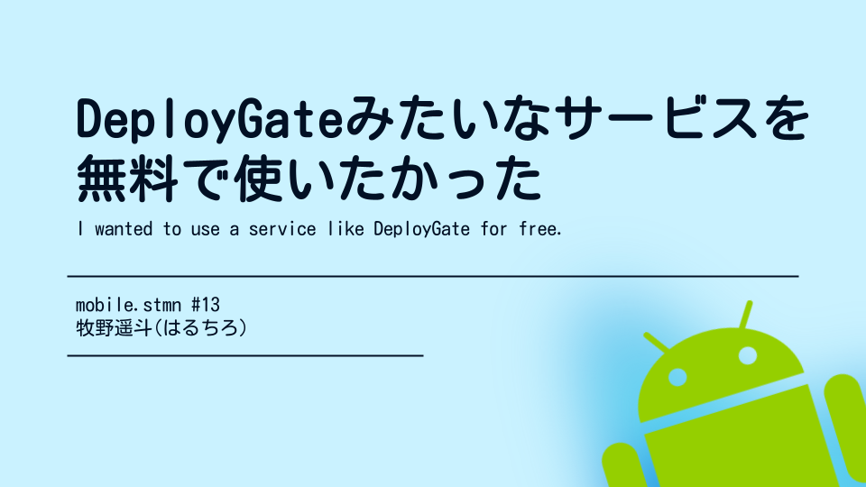
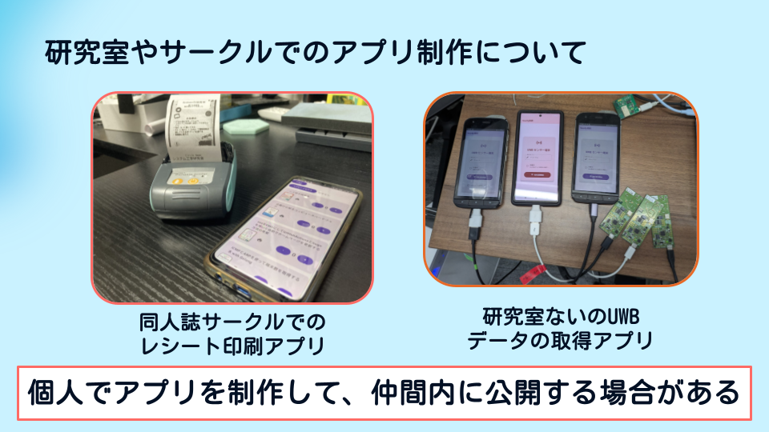
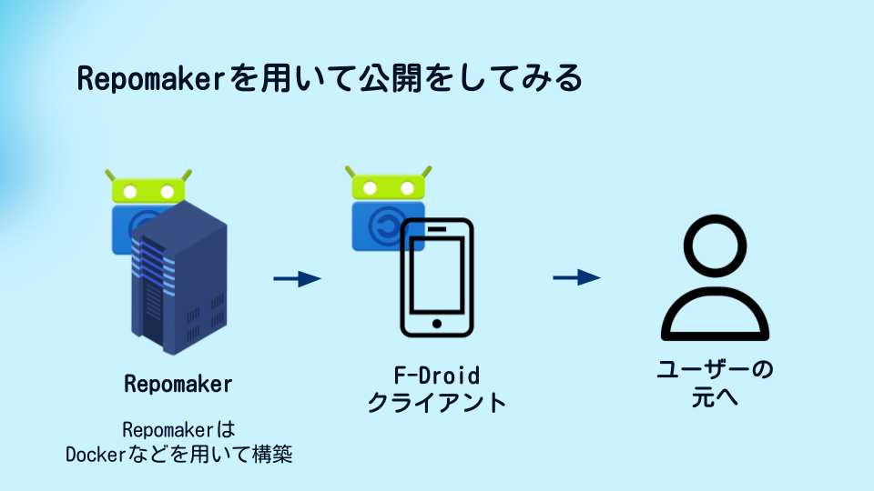
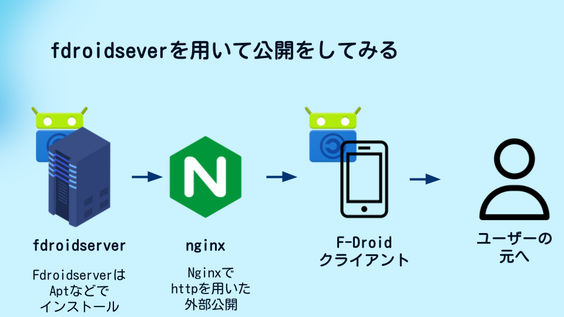
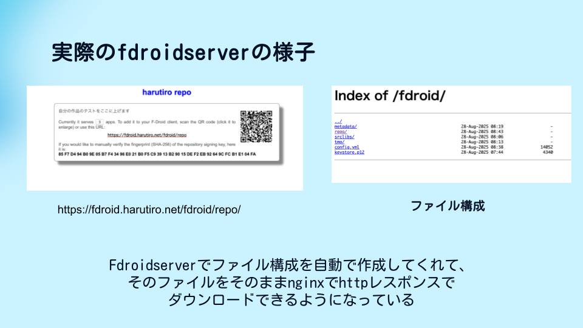
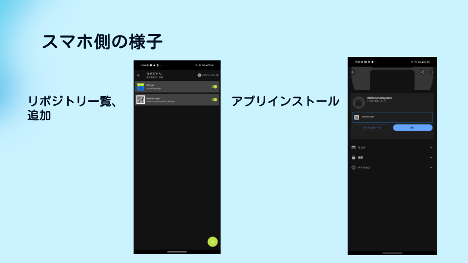

  
無料でAndroidアプリ配布サービスを構築してみたかった

  
牧野遥斗

# 無料でAndroidアプリ配布サービスを構築してみたかった

## 第0章 挨拶

はじめまして、26卒Androidで採用されました、牧野遥斗(はるちろ)と申します。
いつもは、Luciano研究室[^luciano-lab]というサークルで、IoTにまつわる技術書を配布したり、勉強会資料を無料公開したりしています！
技術書典でも配布を行っていますので、ぜひ手に取ってみてください。

[^luciano-lab]: Luciano研究室ホームページ, https://www.stluciano-server.net/

今回の内容は、8月29日に行われました、mobile.stmn #13[^mobile_stmn]で発表した内容を文章にまとめたものです。
カラーで確認したい場合などは、こちらのスライドも併用して確認してもらえるとよりわかりやすいと思います。

[^mobile_stmn]: DeployGateを無料で使いたかった, https://speakerdeck.com/harutiro/deploygatewowu-liao-deshi-itakatuta

### はじめに

モバイルアプリ開発における最も面倒な作業の一つに、開発中アプリをテスターや関係者への配布する作業があります。私自身、大学のサークル活動でAndroidアプリを開発する中で、この問題に何度も直面しました。Google Play Storeの内部テスト機能は手続きが煩雑で、DeployGate[^deploy_gate]のような便利なサービスは有料プランが高額すぎます。

[^deploy_gate]: DeployGateのホームページ, https://deploygate.com/ja

そこで今回、F-Droid[^f_droid]というオープンソースのアプリストアを使って、無料でDeployGateのような配布システムを構築できないか挑戦してみました。結論から言うと、技術的には成功したものの、運用面で大きな課題がありました。

[^f_droid]: F-Droidのホームページ, https://f-droid.org/ja/

本章では、その挑戦の過程で得られた知見と、なぜ結局は商用サービスを使った方が良いのかという率直な結論をお伝えします。同じような課題に直面している開発者の参考になれば幸いです。

## 第1章 なぜアプリ配布が面倒なのか

### 開発現場での配布ニーズ

大学の研究室やサークルでアプリを開発していると、メンバー間でテスト版を頻繁に共有する必要があります。週次のスプリントで新機能を追加するたびに配布し、バグが見つかれば即座に修正版を配布する。デザインの確認のためにUIの変更を何度も試し、実機での動作確認を行う。こうした開発サイクルでは、配布作業が開発スピードのボトルネックになってしまいます。

### Google Play Storeの課題

Google Play Storeにも内部テスト機能はありますが、設定が煩雑な場合もあります。アプリの詳細情報を入力し、プライバシーポリシーを作成し、権限の詳細説明を書き、スクリーンショットまで用意する必要があります。これらは正式リリース向けの仕組みであり、単純な大学の研究室やサークル、個人利用には過剰すぎます。

特にプライバシーポリシーの作成は法的知識が必要で、学生や個人開発者には重い負担です。また、特殊なパーミッションを使う場合は審査も発生し、即座の配布ができなくなります。

### DeployGateという理想と現実

DeployGateは、APKファイルをアップロードするだけで配布でき、専用アプリから簡単にインストールできる理想的なサービスです。リアルタイムのクラッシュレポートやインストール状況の可視化機能もあり、日本語サポートも充実しています。

しかし、無料プランではアプリ数が最大2つ、配布人数も5人までという厳しい制限があります。有料プランは月額16,500円からと、学生や個人には手が出ない金額です。年間で約20万円の費用は、個人プロジェクトで支払うのは難しいです。

### 理想的な配布システムの条件

これらの経験から、理想的な配布システムには次の条件が必要だと考えました。まず経済面では、完全無料で運用でき、ランニングコストがかからず、利用者が増えても費用が増加しない。機能面では、APKファイルをアップロードするだけの簡単操作で、詳細な申請が不要で、即座に配布可能である。そして利用者にとっては、専用アプリでインストールまで完結し、バージョン管理ができる点。

これらの要件を満たすシステムを、オープンソースツールと自宅サーバーでの構築が今回の目標です。

## 第2章 Androidアプリ配布の選択肢

### Google Play Storeエコシステムの活用

Google Play Storeでは、内部テスト（100人まで、基本審査不要）、クローズドテスト（無制限、簡易審査）、オープンテスト（無制限、通常審査）が利用できます。初回登録料25ドルを支払えば長期間利用可能ですが、前述の設定の煩雑さが課題となります。
さらに、アプリのメンテナンスや、アカウントの設定を定期的に行わないと、アカウントの消去や再登録が必要になるため、アカウント自体のメンテナンスの必要がある課題もあります。

### 企業向けソリューション

Managed Google Playは、Android Enterprise環境での企業向けソリューションです。組織専用のプライベートストアとして機能し、EMM（Enterprise Mobility Management）と統合して、一般公開されない限定配布やサイレントインストールが可能です。社内業務アプリや教育機関での学習アプリ配布、BYOD環境での管理に適していますが、個人開発者や小規模チームには適していません。

### F-Droidという選択肢

F-Droidはオープンソースで完全無料なAndroidアプリストアです。プライバシーを重視し、トラッキングを行わず、独自のビルドサーバーでソースコードからアプリをビルドします。暗号化署名により安全性を確保し、分散型リポジトリシステムを採用しています。

F-Droidの技術的な仕組みは、リポジトリと呼ばれる配布サーバーからアプリを配信するものです。各リポジトリには、アプリの情報を記述したメタデータ、実際のAPKファイル、署名情報、リポジトリ内のアプリ一覧を示すインデックスが含まれます。

最も重要なのは、誰でも独自のリポジトリを構築できる点です。これにより完全なコントロール、プライベートな配布、カスタマイズされた配布ポリシー、独自の審査基準が可能になります。

### 配布方法の比較

各配布方法を比較すると、コスト面では、Google Play Storeが初回25ドルのみ、F-Droidは完全無料（サーバー費用のみ）、DeployGateは月額16,500円からとなります。機能面では、人数制限はGoogle Play StoreとF-Droidが無制限、DeployGateはプラン依存。審査はGoogle Play Storeが設定次第、F-DroidとDeployGateは不要。即座の配布はF-DroidとDeployGateが可能、Google Play Storeは条件付き。クラッシュレポートはDeployGateのみが充実しています。

選択の指針として、オープンソースプロジェクトならF-Droid、企業環境ならManaged Google Play、一般配布ならGoogle Play Store、手軽さを重視するならDeployGateが適しています。

## 第3章 F-Droidでの独自配布システム構築

### F-Droidの分散型アーキテクチャ

F-Droidは中央集権的なストアとは根本的に異なる分散型アーキテクチャを採用しています。これにより単一障害点を回避し、検閲耐性を向上させ、組織独自のポリシーを適用し、完全なデータ主権を確保できます。

各リポジトリは暗号化署名によって保護されており、クライアントは署名を検証してリポジトリの信頼性を確認します。この署名ベースの信頼モデルにより、改ざんの検出、偽装リポジトリからの保護、エンドツーエンドの整合性保証が実現されます。

### リポジトリの種類と特徴

F-Droidエコシステムには複数のリポジトリタイプが存在します。公式のF-Droid.orgは完全にオープンソースのアプリのみを扱い、厳格な品質基準とセキュリティ審査を行い、ソースコードからの独自ビルドを実施します。約4,000以上のアプリを収録し、独自リポジトリ構築時の参考実装として優れています。

サードパーティリポジトリの例として、IzzyOnDroidはGitHub Releasesからアプリを自動取得し、公式F-Droidより迅速に更新され、バイナリAPKを直接配布しています。Guardian Projectはプライバシーやセキュリティを重視したTor関連アプリや暗号化通信アプリを配布しています。

個人リポジトリでは、個人プロジェクトの配布、実験的アプリの公開、ニッチな需要への対応、コミュニティフィードバックの収集が可能です。

### Repomakerでの配布方法

最初に試したのがRepomakerというツールでした。これは技術的な知識が少ないユーザーでもF-Droidリポジトリを構築できるよう設計されたグラフィカルツールで、WebGUIで直感的にリポジトリを管理できる点が特徴でした。

WebGUIを用いてAPKファイルのアップロードや公開設定ができる点は魅力的でしたが、実際に使ってみると大きな問題がありました。プロジェクトの更新が長期間止まっているようで、公式ドキュメントで提示されている方法を試しても、私の環境では動作しませんでした。プロジェクト自体のメンテナンスが事実上停止しているようで、実用的ではありませんでした。

### fdroidserverでの配布方法

次に試したのが、fdroidserverというコマンドラインツールセットです。これはF-Droidエコシステムの中核となるツールで、Repomakerよりも高度で柔軟な機能を提供し、本格的なリポジトリ運用に適しています。

fdroidserverは単純なシステムになっており、F-Droidの基本的なアップロード方法として広く使われているため、更新も頻繁に行われ、参考となる記事もたくさん見けられました。実際に構築してみると、技術的には完全に機能するリポジトリを作成でき、nginxと組み合わせてWebサーバーからアプリを配布出来ました。

しかし、運用面で大きな課題が明らかになりました。アプリを更新・作成するたびに、サーバーにSSHでアクセスし、scpでAPKファイルを指定の場所にアップロードし、複数のコマンドを実行してリポジトリを更新する必要があります。DeployGateの「ドラッグ&ドロップでアップロード」と比較すると、非常に煩雑で手間がかかりました。

実際の運用では、APKファイルをサーバーにアップロードし、リポジトリディレクトリに移動し、fdroid updateコマンドを実行し、Webサーバーに同期するという一連の作業が必要でした。これらの作業は、頻繁なアップデートが必要な開発現場では現実的ではありませんでした。

### 最後に

「無料でDeployGateのようなサービスを作る」という当初の目標は、完全には達成できませんでした。技術的には成功したものの、運用面での課題が大きすぎて、実用的とは言えない結果となりました。

しかし、この挑戦で得られた知見は大きいものでした。技術的な知識の獲得、オープンソースエコシステムの理解、そして最も重要な「商用サービスの価値」の再認識を得られました。

もしDeployGateのような「アップロードするだけ」という手軽さを無料で実現するには、今回試したfdroidserverの操作を自動化する仕組みなどを、さらに自力で構築する必要があるでしょう。

同じような課題に直面している開発者の皆さんには、まず商用サービスの利用を検討するといいと思います。そして、もし独自システムの構築に挑戦するなら、運用コストを含めた総合的な判断をしていただければと思います。

技術的な挑戦は、成功しても失敗しても、必ず何かを教えてくれます。この経験が、皆さんの開発活動の参考になれば幸いです。
