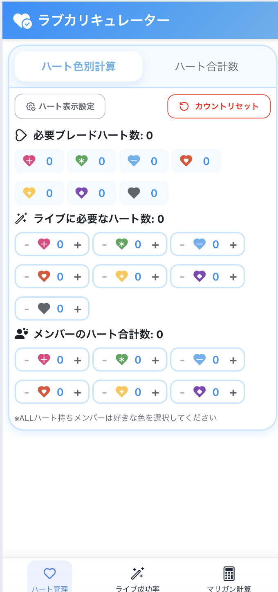
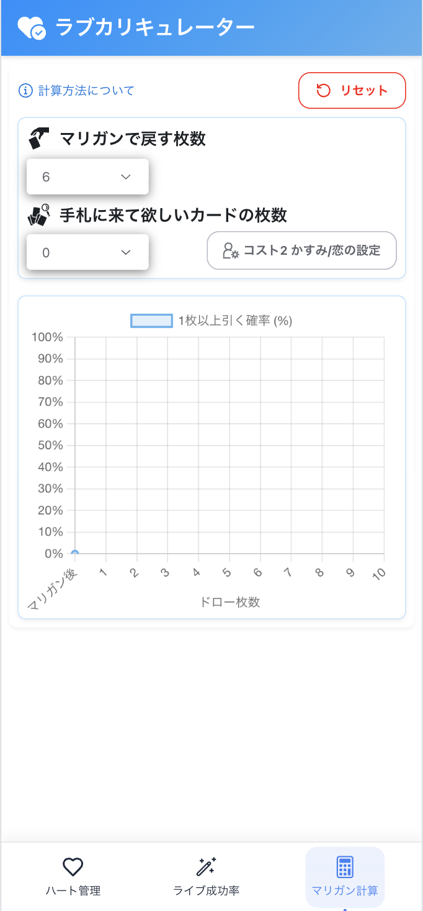

<!-- markdownlint-disable MD041 -->

  
Vercelでデプロイした個人開発のカードゲーム補助ツールが月1,000アクセス達成するまで

  
三海 純

<!-- markdownlint-disable MD034 -->
# Vercelでデプロイした個人開発のカードゲーム補助ツールが月1,000アクセス達成するまで

## はじめに

個人開発で「カードゲームの補助ツール」を作り、Vercel にデプロイして公開しました。
ありがたいことに月 1,000 回以上アクセスされるようになり、予想以上に多くの方に使っていただけています。

この記事では、

- どんなきっかけでツールを作ったのか
- どのような技術を使って開発したのか
- 作った後にどう広めていったのか

についてまとめてみました。
同じように「自分で作ったプロダクトを誰かに届けたい」と考えている方の参考になれば嬉しいです。

## プロダクト内容

ラブライブ！シリーズ オフィシャルカードゲームの計算ツールを作ってみました。

プロダクトURL: https://loveca.vercel.app/

ゲーム中の計算管理や構築する時の確率計算ができます

左がカウンター機能、右が確率計算機になります

|カウンター機能|確率計算機|
| --- | --- |
|  |  |

## なぜ作ったのか？

ある日、友人たちとカードゲームを遊んでいたときのこと。
「この前カードショップで面白い人を見かけてさ」という話題が出ました。

なんとその人、ゲーム中に複数のスコアを管理するため、そろばんにシールを貼って使っていたそうです。
ちょっとした工夫ですが、驚くほど直感的でわかりやすい仕組み。
その話を聞いて「なるほど、アイデア次第で複雑な管理もこんなにシンプルにできるんだ」と感心しました。
そこから自然と「じゃあアプリで同じことをやったらもっと便利かも？」と考え、まずはカウンター機能を作ってみました。

さらに、カードゲームでは「特定のカードが1枚でも手札にあれば十分」という場面がよくあります。
ただ、実際にどのくらいの確率で引けるのかは感覚に頼りがちで、正確に把握するのはなかなか難しい…。
そこで次に作ったのが、初期手札の枚数と欲しいカードを入力するだけで、最大10ドローまでにそのカードを引ける確率をグラフ化してくれるツールです。
余計な操作は一切なく、「欲しいカードがどのくらいの確率で来るのか」をシンプルに確認できるようにしました。

## 主な使用技術

### Next.js + React + TypeScript

React は「UI（見た目）を作るためのライブラリ」で、世界中に部品やツールが揃っているので開発しやすいのが強みです。
そこに Next.js を加えると、SSG（静的サイト生成：ページをあらかじめ作っておき、完成品を配信する仕組み）といった高速化の仕組みを簡単に使えるようになります。そのため、Reactの柔軟さと Next.jsの速さをいいとこ取りできるのが採用理由です。

- Next.js: https://nextjs.org
- React: https://react.dev
- Typescript: https://www.typescriptlang.org

### Radix UI

### デザインは完全に自由

一般的な UI ライブラリのように「最初から見た目が決まっている部品」ではなく、Radix UI は見た目を持ちません。
そのため CSS や Tailwind、あるいは自作のスタイルと自由に組み合わせて、プロジェクト独自のデザインをそのまま活かせます。
「アクセシビリティは任せて、デザインは自分で作りたい」人にぴったりです。

### プリミティブ単位の部品構成

コンポーネントは小さく分かれた「プリミティブ」として提供されており、それらを組み合わせることで必要な UI を柔軟に作れます。
例えばモーダルやドロップダウンも「土台の部品＋必要な装飾」を積み上げるイメージ。
これにより、ライブラリに縛られることなく、自分のアプリに合った UI を組み立てられます。

ドキュメント: https://www.radix-ui.com

### Chart.js

確率計算の結果は Chart.js でグラフ化しました。
数値の羅列では直感的に理解しづらい部分も、折れ線グラフにすることで「引ける確率がどのくらい上がっていくのか」を一目で確認できます。
軽量で導入も簡単なので、小規模な個人開発にはちょうど良かったです。

ドキュメント: https://www.chartjs.org

### Storybook + Chromatic

UI の開発では Storybook を使い、ボタンや入力欄といった部品を「ページから切り離した状態」で確認しながら作りました。
全体のアプリを動かさなくても、部品単位でサクッと見直せるので開発効率が上がります。
さらに、Chromatic と組み合わせることでデプロイ前に自動で「見た目の差分チェック」が走ります。
「昨日までは正しく表示されていたのに、今日いじったらボタンがずれていた…」といった“見た目の事故”を早めに気づけるのがとても便利でした。
結果として、UI の品質を維持しながら安心してリファクタリングや機能追加ができるようになりました。

- Storybook: https://storybook.js.org
- Chromatic: https://www.chromatic.com

### Vitest

テストランナーは Jest をはじめ選択肢がいくつかありますが、今回のツールでは Vitest を採用しました。理由は大きく3つあります。

#### Vite との相性が抜群

プロジェクト自体を Vite で構築している場合、テストも同じ仕組み（ESM や高速ビルド）をそのまま利用できるのが Vitest。
Jest だとトランスパイルの設定や ESModules 周りの対応が面倒になることがあるのに対し、Vitest は「設定ほぼ不要」で動かせました。

#### 速度が圧倒的に速い

立ち上がりもテスト実行も体感でかなり軽いです。小規模プロジェクトだと「テストを書くかどうか」で迷うこともありますが、Vitest なら実行がストレスにならないので「とりあえず書こう」という気持ちになれました。

#### Jest ライクな API で移行が簡単

describe や it、expect といったおなじみの書き方がそのまま使えます。もし将来別の環境で Jest に移行したくなっても、テストコードを書き直す負担はほぼありません。

Vitest: https://vitest.dev

### Vercel + Analytics

GitHub に push するだけで即座に反映され、CDN 配信で表示も速いのが決め手でした。また組み込みのVercelのAnalytics を使うことで「どのくらいアクセスされているのか」「どのページがよく見られているのか」を軽く把握でき、改善の参考にもしています。

Vercel: https://vercel.com

## アプリをどう広めたか？

ここからは技術的な話というより、「作ったものをどうやって広めたか？」についてです。
とはいっても特別なことをしたわけではありません。

自分がやったのはシンプルで、カードゲームの戦略記事をひたすら書くことでした。

(記事URL: https://note.com/miumi_loveca)

記事の最後や SNS（X）で自然にツールを紹介しつつ、解説の中で確率を説明するときには自作アプリを実際に使って見せる。
そうすることで、読んでいる人に「このツールがあると便利そうだ」と思ってもらえました。

大事にしたのは、プロダクトの宣伝「だけ」に偏らないこと。
あくまで 一人のカードゲームプレイヤーとして役立つ記事を書くことを第一にして、その延長線上でツールを紹介する形を心がけました。

気がつけば、これまでに書いた記事は 70 本以上。
記事が積み重なるにつれて、自然と多くの人にプロダクトを知ってもらえたのだと思います。

## 終わりに

以上、カードゲームの補助ツールを作り、公開し、広めていった経緯を紹介しました。

今回改めて感じたのは、「役立つものを作ること」と「それを自分なりの形で発信すること」の両方が大事だということです。
技術的には小さな個人開発でも、記事やSNSでの発信を通じて、多くの人に使ってもらえる可能性があります。
もしこの記事を読んで「自分も何か作ってみようかな」と思っていただけたなら、それが一番の喜びです。

<!-- markdownlint-enable MD034 -->
