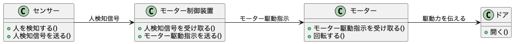
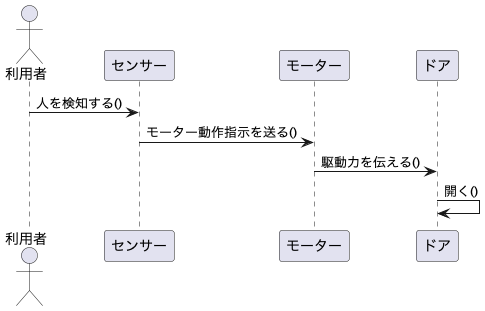

<div class="doc-header">
  <div class="doc-title">AIはモデリング言語話者になりえるか</div>
  <div class="doc-author">もるもるぷいかー</div>
</div>

# AIはモデリング言語話者になりえるか

昨今、AI が目覚ましい発達を遂げています。
特にプログラミング領域において、AI は欠かせないツールのひとつであると認識している方もいるでしょう。
かつて人間が負担していたコーディング作業を肩代わりする存在として、時間が経過するにつれて、その有用性が上がっています。

ソフトウェアの開発段階には、**設計**があります。
設計は、制作するシステムがどのような構造であるかや、どのような動作をするかを定義し、目的や仕様を共通認識化するという役割があります。
コーディング作業で必要不可欠となった AI が、より上流工程に近い設計の段階で利用可能であるかどうか、特にモデリング言語について注目して、実体験を交えて考察します。

## モデリングとモデリング言語について

モデリングとは、抽象化された概念をもとに、システムの全体像をわかりやすく表現することです[^入門UML2.0]。
近年、ソフトウェアシステムは大規模化しており、その全貌を誤りなく把握することは困難になっています。
そこで、ソフトウェアシステムのシステム設計の重要な部分に注目し、関連のない詳細や、冗長な詳細を排除することで、全体の理解を助けます。
ここで重要なことは、**細部ではなく全体を示す**ということです。
モデリングによって、細部ではなく全体を見渡せるようになり、システム設計の重要な側面に焦点を当て、それを表現し、文章化し、他者に伝えることができます[^入門UML2.0]。
抽象化し、単純化することで、システム全体の理解を促します。

[^入門UML2.0]: Russ Miles, Kim Hamilton 著、原 隆文 訳. 入門 UML 2.0. 株式会社オライリー・ジャパン, 2007, 1p.

モデリング言語とは、モデリングを行うための表記法です。
モデリング言語は、**ソフトウェアシステムのシステム設計を他者にわかりやすく共有する**ことを目的に利用します。
統一した書式を用いることで、形式的かつ意味的に設計を表現できます。
これにより、冗長性や曖昧さを排除し、書き手と読み手で認識がズレることを防げます。
特に本稿では、**UML(Unified Modeling Language)**と**SysML(Systems Modeling Language)**について着目します。
また本稿では、以降、モデリング言語を用いて制作した成果物のことを、モデルと呼びます。

UML は、ソフトウェアを形式化するための統一的なモデリング言語（図式言語）です[^かんたんUML入門]。
UML は、設計を示す「言語」であり、開発や設計のプロセスそのものではありません。
UML の歴史として、オブジェクト指向の考え方を取り入れており、一部の表記法に親和性があります。
UML の基本的な構成要素は図であり、UML 2.0 の図は、**構造図**と**振る舞い図**の 2 つに分かれます。
構造図であるクラス図やコンポーネント図、振る舞い図であるシーケンス図やステートマシン図などの種類の図があります。

[^かんたんUML入門]: 竹政昭利，林田幸司，大西洋平，三村次朗，藤本陽啓，伊藤宏幸. かんたんUML入門. 技術評論社, 2013, 42p.

SysML は、システムを実現する際に効果を発揮するモデリング言語です[^実践SysML]。
UML は、ソフトウェアシステムを対象とします。
対して SysML は、ソフトウェアに限らず、ハードウェアなども含めた、システム全体を対象とします。
SysML は、UMLの言語仕様の一部を再利用した部分と、新たに拡張した部分からなります。
UML の言語仕様を再利用したシーケンス図や、UML の言語仕様を一部修正したアクティビティ図、新たに SysML で定義した要求図などの図があります。

[^実践SysML]: 鈴木茂、山本義高. 実践SysML - その場で使えるシステムモデリング. 西和システム, 2013, 16p.

## 自分の考えと結論

本題です。
「AI がモデリング言語話者である」という言葉が曖昧なので、「モデリング言語を用いたモデリングにおいて、AI を利用することでメリットが生まれる」ことと言い換えます。
私は、**目的や状況次第では利用可能だが、かなり稀である**と考えました。
将来はともかく、今現在はモデリングにおいて、AI を用いることで得られる利点はあまりないでしょう。
実際に、私の場合は、AI によってモデリングの品質は**ほとんど向上しませんでした**。

とはいえ、モデルを制作する目的は様々であり、モデルに求める品質や内容も全く違います。
そのため、一概に利用可能である、利用可能でないと言い切ることはできないと考えています。
同時に、目的や状況が適切であれば、十分に AI を利用するメリットがあるとも考えています。

AI がモデリング言語話者であるとみなすためには、以下の 2 つの能力を備えていることが条件でしょう。

- AI がモデリング言語を理解できる。
- AI がモデルの図を出力できる。

本稿では、AI がモデルを出力できるかについて詳しく述べます。
前者については、他の言葉での言い換えや、数値で表しにくいものを本稿で示すことが難しいため、省略することにしました。
一度書き上げたのですが、何が達成できるとモデルを理解できると言えるかのゴールを明確にできなかったため、全カットしました。
以降、AI がモデリング言語話者である条件のひとつである、AIがモデルの図を出力できるかについてを述べます。

これについては、必ずしも図そのものを出力する必要はないでしょう。
モデルの図に相当する別のものを出力させ、それを既存のツールで図に変換できれば、モデルの図を出力できると言って差し支えないでしょう。

### どのような状況でAIがモデルの図を出力できるか

実際にどのような状況が揃えば、AI でモデルの図を出力できるかを考えます。
本稿で挙げる状況は、以下をすべて満たす状況です。

1. すでに設計する対象のソフトウェアのソースコードが存在する
2. AI がテキストを理解でき、テキストを入出力できる
3. テキストベースでモデルの図を出力できる
4. トレーサビリティーを厳密に維持する必要がない

これらの状況を満たすことで、以下の順でモデルの図を生成できます。

1. ソフトウェアのソースコードをAIへの入力として渡す
2. AI の出力として、モデルの図を描画するテキストを得る
3. 2. で得た AI の出力から、モデルの図を得る

#### すでに設計する対象のソフトウェアのソースコードが存在する

AI が参照可能な、モデル化する対象のソフトウェアの動きを全て定義したソースコードが存在する場合です。
私の体験状況だけでなく、多くの状況で満足のいくモデルを AI が生成できます。
具体を抽象化することであり、動作に必要な最低限の情報は揃っているため、当然といえば当然です。
意図や思想は反映しにくいですが、ソースコードにコメントアウトで記述すれば十分反映可能です。

先述したように、通常は、設計はコーディングよりも前の段階で行われます。
この状況は、**すでにあるソフトウェアについて、構造や振る舞いを全体的に説明する**という状況です。
すなわち、自分らが制作したシステムのリバースエンジニアリング（システムの実装からシステムの設計を抽出すること）です。
この状況でモデルを求めることはあまりないでしょう。
情報を削ぎ、図を用いて全体の構造や振る舞いを簡略化し、他者へ説明する目的であれば、十分です。

出力するモデルの品質は、ある程度の制御ができます。
例えば、詳細の具合はかなり自由に制御できます。
ソースコードの内容を網羅的に図示する、一部の構造や振る舞いを簡略化して全体を図示する、一部の構造や振る舞いに注目し、詳細に図示するなど、AI への指示によって制御できます。

#### AIがテキストを理解でき、テキストを入出力できる

ソースコードを参照させる上で、テキストを理解できる AI である必要があります。
さらに、AI に詳細な指示を与える上で、指示や意図の言語化が必要です。
現在では大規模言語モデルが適切ですが、将来的に、上記を満たす大規模言語モデルではないAIが台頭した場合も、この状況を満たすでしょう。

上記より、テキストを入力できる機能が必要です。
また、3 つ目の状況ともつながる要素として、モデルの図を出力するためのテキストを出力する機能も必要です。
詳細は、3 つ目の状況で説明します。

#### テキストベースでモデルの図を出力できる

これは、**PlantUML** や **draw.io** など、テキストを入力として、モデルの図を出力するツールが必要であるという意味です。
2つ目の状況で、モデルの図を出力するためのテキストを出力する必要があると述べました。
これは、上記のツールである入力を、AIが出力する必要があるためです。

#### トレーサビリティーを厳密に維持する必要がない

本稿では、トレーサビリティーが維持できている状態を「複数の図の間で、矛盾や表記揺れなどがなく、一貫性がある状態」と定義します。
詳細は後述しますが、AI を利用しても、トレーサビリティーがほぼ維持できません。
複数の図を AI で出力する場合、図の内部で矛盾がないかを確認することは当然として、それぞれの図の間でトレーサビリティーを確認する必要があります。
必要な図の数が少ない場合は、確認すべき箇所が減るので、比較的にトレーサビリティーが維持しやすいです。

### 実際に利用した環境

上記の方法で、私が実際にモデルの図を制作するために用いた、AI やツールなどの環境を紹介します。

- Visual Studio Code (以降VSCode)
- Claude Code (Sonnet 4.0)
- PlantUML (VSCode の拡張機能として利用)
- draw.io (VSCode の拡張機能である Draw.io Integration を利用)

VSCode は、PlantUML、および、draw.io の VSCode の拡張機能を導入しました。
これにより、出力である図を確認したり、GUI 上で図のコンポーネントを操作して作図するために利用します。
以降の PlantUML, draw.io は、それぞれ VSCode の拡張機能についてを述べます。

また、私がモデルを制作した理由は、ET ロボコン[^ETロボコン公式サイト]参加にあたって、成果物として提出するためです。
提出期限の関係から、実装したソースコードを参考にモデルを制作、および、修正できました。
ツールも自由に選定できたため、1 から 3 の状況が揃っていました。
しかし、4 の状況のトレーサビリティーの維持が難しく、確認作業が途方もなく感じました。
下書き程度には利用しましたが、最終的な提出物には、AI で書いたものそのものや、それを添削したものは含みませんでした。

[^ETロボコン公式サイト]: ET ロボコン, 組込みソフトウェア技術教育をテーマとした「ET ロボコン」, <https://www.etrobo.jp/>, 最終アクセス日：2025/09/30

### AIの利用によって生じたメリット

モデリングに AI を利用したことで、以下のメリットがありました。

- 高速でそれらしい成果物ができる
- 一部の図で誤りが少ない

#### 高速でそれらしい成果物ができる

前述したモデルの性質上、絶対的な正解はありません。
また、ソースコードという具体を入力として抽象化するため、的外れな出力を生成することは稀です。
モデルに求める品質にもよりますが、それらしい品質の出力を得やすいです。

この観点から見たときに、クラス図やシーケンス図の出力はうまくいきやすかったです。
最初の出力でそれらしい図が得られました。

#### 一部の図で誤りが少ない

ここでいう誤りとは、1 つの図の内部にあるものであり、トレーサビリティーのことではありません。
クラス図など、情報量が多く、わかりやすく間違いが生まれやすい図でなければ、特に違和感なくモデルの図が生成できます。
高速でそれらしい成果物ができる利点に、クラス図を挙げましたが、誤りが少ないかの観点では微妙でした。
それらしくはあるのですが、よく見ると関係が間違っていたり、コメントアウトしたメソッドの説明とは別の言葉を使って間違っていたりと、色々ありました。

### AIの利用によって生じたデメリット

AI を利用したことで、不便に感じた点や、発見した課題点を、AI の利用によって生じたデメリットとしてまとめます。
AI の利用によって生じたデメリットを、以下に示します。

- draw.io と LLMの相性が悪い
- 詳細な図に間違いを比較的多く含む
- トレーサビリティーの維持がほぼできない

#### draw.io　と　LLMの相性が悪い

生成に時間がかかる、UML や SysML の図で用いるコンポーネントが標準のものでないためか、意図したコンポーネントを使わないなど、致命的というほどではない不便なところが目立ちました。
何度か出力させたところで、AI　ではなく手作業での作図に移行しました。

また、draw.io を構成するファイルである .dio(.drawio) も LLM との相性が悪いです。
.dio ファイルは、タグによってコンポーネントの種類や色、フォント、座標などを表現する XML 形式で構成されます。
例として、提出した成果物で用いたクラス図を構成する .dio ファイルの一部を、以下に示します。

```
<mxCell id="system_info" value="&lt;&lt;constants&gt;&gt;&#xa;システム情報" style="swimlane;fontStyle=1;align=center;verticalAlign=middle;childLayout=stackLayout;horizontal=1;startSize=64;horizontalStack=0;resizeParent=1;resizeParentMax=0;resizeLast=0;collapsible=1;marginBottom=0;fillColor=#bac8d3;strokeColor=#23445d;fontFamily=BIZ UDPGothic;fontSource=https%3A%2F%2Ffonts.googleapis.com%2Fcss%3Ffamily%3DBIZ%2BUDPGothic;fontSize=22;" parent="1" vertex="1">
```

これは、あるクラスのクラス名の区画（クラスの上段のセル）を示す、.dio ファイルのコードです。
全てのセルがこれほどの文字数ではありませんが、セルひとつでこれだけの文字数のものもあります。
出力に多くのトークンを消費しますし、出力に時間がかかります。
.dio ファイルを入力として、図を修正する場合も、同じことが起こります。
グラフィカルな要素を、高い自由度を保ったままテキスト形式で管理する上で、仕方がないことですが、LLM と相性が悪いのは事実でしょう。

私は、クラス図やパッケージ図などの作成に draw.io を利用しました。
PlantUML ではクラスの配置を細かく設定できず、紙面の都合から、クラスを自由に配置できる draw.io の方がよいと判断したためです。

#### 詳細な図に間違いを比較的多く含む

構造図の中でも情報量が多い、クラス図でよく起こりました。
おそらく、入力として AI に渡す情報量が多くなるためです。

例えば、クラス間の関係性を示す「関係」は、6 種類あります。
オブジェクト指向の開発では、おおよそ、1 クラスを 1 ファイルで構成することが多いです。
クラス間の関係を把握するためには、最低でも 2 ファイルの内容を入力として渡す必要があります。
プロジェクト内のあるクラスに注目したとき、関係がないクラスもあります。
同様に、複数のクラスと関係があることもよくあります。
結果として、入力として AI に渡す情報量が多くなり、関係の種類が間違っている、本来関係があるべきクラスと関係がある、本来関係がないクラスと関係があるなどの誤りがありました。

例に挙げた関係だけでなく、属性、関連名、関連端名、多重度など、考慮すべき要素が多いです。
AI が出力したクラス図に間違いがないかを確認する時間や手間もかかります。
何も手を加えない場合は、品質が低くなりやすく、あまり有用性を感じられないでしょう。


#### トレーサビリティーの維持がほぼできない

自分らが最終的な成果物に利用しなかった主な理由です。
これについては、AI を利用している場合に限らず、人間がモデリングしても、完璧にトレーサビリティーを維持することが困難です。
AI を利用したことで新たに生まれた課題ではありませんが、AIを使わずにモデリングした方が、トレーサビリティーを維持できることが多いでしょう。
トレーサビリティーが維持できなくなる要因としては、特に、I/F（インターフェース）の矛盾や表記揺れが起こりやすい印象があります。

自動ドアを例に、クラス図とシーケンス図を AI に出力させたときのことを考えます。
自動ドアが開くとき、以下のような動作をシステムが実行するとします。

1. 自動ドアのセンサーが、人を検知する。
2. センサーが、モーター制御装置へ、人検知信号を送る。
3. モーター制御装置が、センサーから人検知信号を受け取ると、モーターへモーター駆動信号を送る。
4. モーターが、モーター制御装置からモーター駆動信号を受け取ると、モーターが回転する。
5. モーターが回転すると、ドアへ駆動力を伝え、ドアを開く。

上に示すシステムの構造を示すクラス図の例を、図 1 に示します。
簡単のため、関係の種類や多重度などは考慮していません。

<figure>
  
  <figcaption>自動ドアが開く動作に関わるシステムの構造を示すクラス図の例</figcaption>
</figure>

AI が、以下のようにシーケンス図を出力したとします。
上に示すシステムの振る舞いを示すシーケンス図の例を、図 2 に示します。
こちらも簡単のため、人の検知を待つループなどを省略しています。

<figure>
  
  <figcaption>自動ドアが開く動作の振る舞いを示すシーケンス図の例</figcaption>
</figure>

クラス図に表記を合わせるとすると、シーケンス図には、矛盾と表記揺れがそれぞれ 1 つ含まれています。
シーケンス図が含む矛盾と表記揺れを、以下に示します。

- モーター制御装置のライフライン（「モーター制御装置」と書かれた四角と、その下に伸びる線）がない（矛盾）
- センサー・モーター間で、モーター駆動指示ではなく、モーター動作指示が送られる（表記揺れ）

モーター制御装置がまるまる消えているので、人検知信号が送られているかどうかや、送られているとして、どこに人検知信号が送られているかがわかりません。
入力や出力が噛み合っていない、I/F が不適切な例のひとつです。

モーター駆動指示とモーター動作指示の表記揺れについては、文字は似ていますが、モデルでは別物として扱われます。
先述したように、モデリング言語の利点のひとつは、曖昧さを排除できる点です。
このように、I/F に矛盾や表記揺れがあると、構造や振る舞いを正確に表記できているとは言えません。

前述したように、モデルの規模が大きくなると、人間がくまなく確認しても、トレーサビリティーを完璧に維持することは困難です。
AI を用いる場合も同様に、いくつかの矛盾や表記揺れを含むことがありました。
動作確認で明確な間違いがわかりやすいプログラムと比較して、モデルは潜在的な矛盾や表記揺れを地道に見つける以外に不正解を見つける方法がありません。
モデルの規模によりますが、1 種類の図だけでモデルが完結することはあまりありません。
構造図だけでは、非同期的な処理の流れを示しにくいですし、振る舞い図だけでは、クラスやオブジェクト同士の関係を示しにくいです。
そのため、トレーサビリティーの維持が必要な場面がほとんどであり、個人的に最も課題に感じた点でした。

## ET ロボコンで提出したモデルについて

本題と逸れますが、今年も ET ロボコン（詳細は、前巻のゆめみ大技林の私のページで書いたので省略します）に宮崎大学のチーム KatLab の一員として参加し、モデルを提出しました。
今年は全国大会へは進めませんでしたが、モデルでは A- という、全国大会でも上位のチームしか取れないグレードの成績をいただきました。

モデルの画像を Google Drive に共有フォルダとしてまとめました。
モデルの画像を見たい方は、次のリンク、もしくは QR コードからご覧ください。
モデルの画像をまとめた Google Drive の QR コードを、図 3 に示します。

```url
https://drive.google.com/drive/folders/1hkFd396U0KZsbiNAD6lsFeX2MSkv7pCg?usp=drive_link
```


また、今年の競技内容とモデルの審査基準については、競技規約[^競技規約]と審査規約[^審査規約]をご覧ください。

[^競技規約]: ET ロボコン実行委員会, ET ロボコン 2025 競技規約 1.0.2 版, <https://docs.etrobo.jp/rules/2025/ETRC2025_rules_primary_advanced_1.0.2.pdf>, 最終アクセス日：2025/09/30

[^審査規約]: ET ロボコン実行委員会, ET ロボコン 2025 審査規約 1.0 版, <https://docs.etrobo.jp/rules/2025/ETRC2025_dev_shinsa_rules_V1.0.pdf>, 最終アクセス日：2025/09/30

## まとめ

AI がモデリング言語話者になりえるかを考えた結果、少なくとも現在は難しい場合がほとんどであるという結論になりました。

仕様はオラクルであり、仕様策定者である人間にしか、仕様が正しいかどうかを判別できません。
そのため、設計の過程を AI に任せるには、どうしても限度があります。
AI に仕様を決めさせるのは、モデリングから逸脱しています。
また、モデリング言語はあくまでモデルの図を表記する言語形式であり、モデルの品質までは保証できません。
ある視点から見て満足のいく品質でも、別の視点では品質を満たしていない場合が多いです。
このように、AI という不確定かつ不安定なツールに頼るには、様々な面から解決困難な課題が複数存在します。

トレーサビリティーについては、モデリング言語の図そのものの問題というよりも、モデルの品質の問題にも思えます。
モデリング言語話者になったとして、モデルの品質が向上するかどうかは、別に課題がありそうです。
現時点で、AI が品質を保証できない設計の分野は、人間が活躍できる分野のひとつであると考えています。


