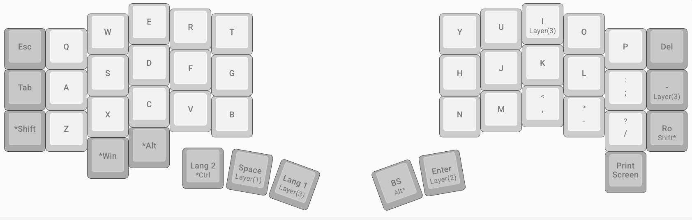
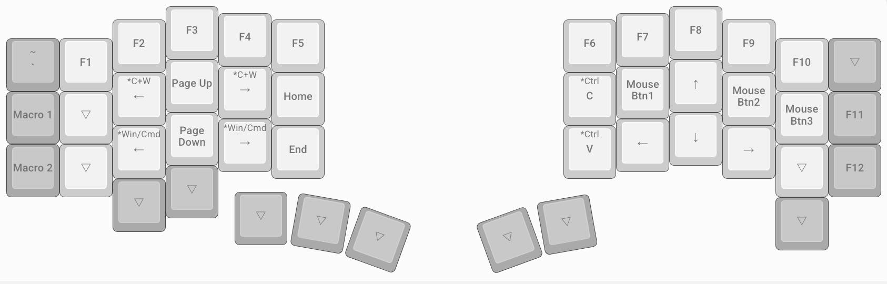
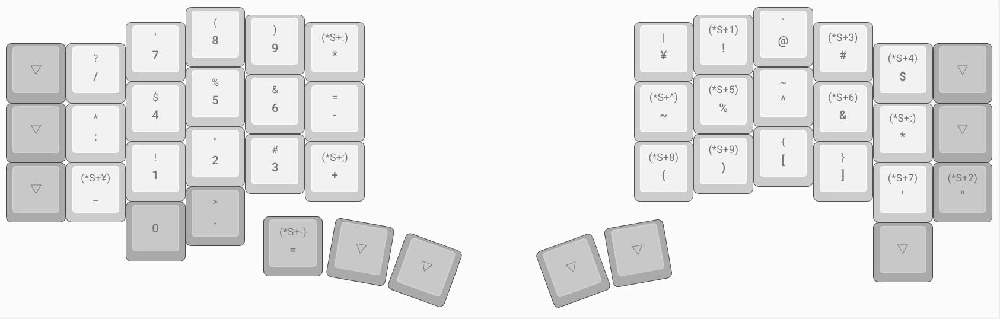
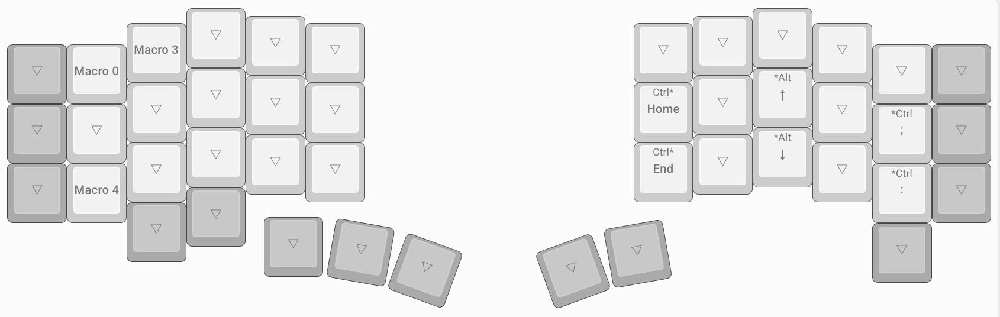
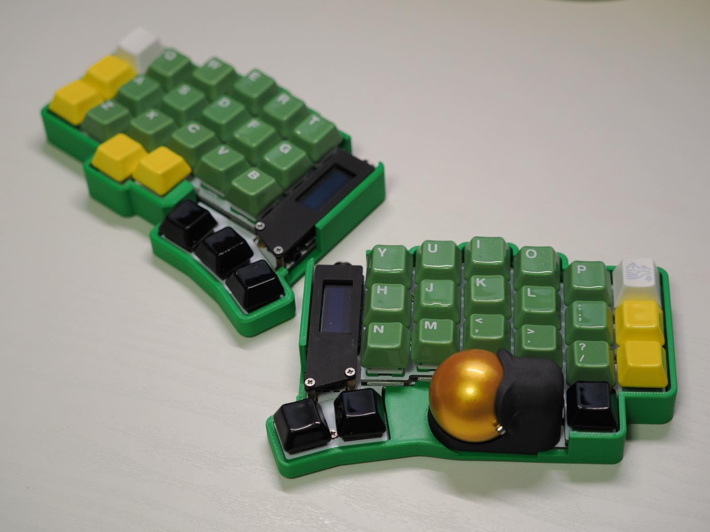

  
エンジニアにこそ広まってほしい自作キーボードの世界

  
もつ

# エンジニアにこそ広まってほしい自作キーボードの世界

エンジニアにとってキーボードは仕事道具であり、趣味の道具と言っても過言ではないでしょう。様々なキーボードを購入している人の中で、いつか自作キーボードへと手を出してみようと思う方もいるかもしれません。ちょっとでも自作キーボードに興味のある人に対してチャレンジしてみようと思えるように書いてみました。

## 自作キーボードにまだ手を出す人が少ない理由
キーケットや天下一キーボードわいわい会といった自作キーボードの即売会に多くの人が参加するようになっています。キーボードを仕事道具として常に使用しているソフトウェアエンジニアやクリエイター業でも使いはじめましたという報告もよく見るようになりました。それでも自作キーボードを仕事道具として選ぶ人はまだ少ないと感じております。実際に自分がこれまで導入に躊躇していた理由を挙げてみます。
### 値段が市販品よりも高いものが多い

 自作キーボードはだいぶ一般的になってきているのと3Dプリンターが安くなってきたので一時期よりも手に入りやすい値段になってきています。それでも3万円からと考えるとやはり一般的には安いとは言い難いです。（ここの沼にいると安く感じてきますが……）
 
### レイヤー機能やMod tap等の機能への慣れが必要

  キー数が少ないとレイヤー機能というのを多用することになります。これはShiftキーを押すと別の記号が入力されるのをイメージしていただけたら想像しやすいと思います。また、キーをタッチするか長押しするかで機能を変えること(Mod tapと言います)もでき、キー数が少なくても入力できるのはこれら（本当はもっとありますが）を多用するからです。慣れないと自分がどのレイヤーを入力しているのかがわからなくなり、あのセキュリティが低いとして有名な「P@ssw0rd!」ですらも難解に感じるほどです。
  
 ### はんだづけが必要になるので時間と手間がかかる

 これは始めるまで同じことを考えていましたが、やり始めるとただの単純作業がほとんどで、想像よりも難しくはなかったです。プラモデル作成のほうがもしかしたら難しいかもしれないです。（個人の感想です）

## 自作キーボードを明確に推す理由
他の市販のキーボードだとREALFORCEやHHKBが有名ですし、KeychronやLogicoolもいいキーボードを出しております。こういったキーボードとは異なり、自作キーボードは文字通り自作することが必要になります。

 ### キーマップを自由に変更できるので打ちやすさを追求できる

 一般的な配列や記号、数字、Fキーの配置を自由に配置できます。手の大きさによっても遠くのキーの押しやすさは変わってきますし、この辺にあったらいいのにというのを自分で自由に設定できます。
 ### キー数を好きなもので利用できる

 キー数が少ないとホームポジションから動かさずにすみますし、大きめのキーボードならレイヤー機能を使わずに押せます。それぞれ好みがあるのをより自由に選ぶことができます。
### 個性あるキーボードから自分にあった使い方を選べる

 トラックボール一体型やトラックパッド付き、分割や一体型と見るだけでもおもしろい機能を持つものがそこに待っています。マウスとキーボードとの移動が完全になくなるので、手元を一切みないで操作することができるようになります。
### 色や材質のカスタマイズが楽しい

 キーキャップの材質や色、キースイッチの押し心地と見た目を徹底的に自分好みにカスタマイズできます。メカニカルキーボードでできることを自作キーボードでもできるので、より自分の色を出すことができます。

## キーマップのカスタマイズ例
自分の仕事がインフラSREでコードをあまり書かないというのもありますが、何を割り当てるのかを決めかねているので発展途上です。といっても基本的な部分は固まってきており、今でも新しくキーボードを作って割り当てる時にも大きく変えないようにしています。対象のキーボードはトラックボール付きのキーボードが一気に広まったと言っても過言ではないKeyballシリーズのKeyball44です。

### レイヤー0：通常の文字を打つ

変わった配列も割り当てることを考えましたが、結局は世の中の殆どが使っているQWERTY配列を採用しております。こうすると今まで使っていたキーボードに戻る時に違和感を軽減できるためです。自分のキーボードやデバイスしか使わないのでしたら考慮する必要はないですが、本番ルームでの作業にキーボードを持ち込むことができないので、キー配置を変えすぎると、作業効率が悪くなってしまいます。 
 
さて、間違って押してしまうcaps lockキーが割り当てられていないことが分かると思います。自分にとって必要なもの不要なものをカスタマイズできるので、おそらく真っ先に消されるのではないでしょうか。caps lockの入力をctrlに変換している人は、最初からキー配列の設定でctrlを割り当ててしまえばいいだけです。
記号は別レイヤーに置くのでよく使うのだけをここに割り当てています。「-」とか結構頻繁に使うのに、割と遠くにあると思いませんか？`--version`などのオプションにもーは使うので、ここに移動してきてからはかなり快適になってます。ぜひこの便利さを体験してほしい……。あとはスクリーンショットも撮影しやすいようにここにおいています。GUIで操作しないと行けない作業でのエビデンス取得に役立っています。

親指にはEnterキーやBackspaceキーをはじめ、いろんな機能を利用できるように配置しています。最初こそ親指で押すのに違和感ありましたが、慣れてくるとこちらが楽になってきます。市販のキーボードでは、これらのキーを小指で押す必要があり、ものによってはホームポジションから離れています。小指の負担を軽減することができるので、疲労感もだいぶ変わってきます。

### レイヤー1：移動キーとFキー

矢印キーやウィンドウの移動をすることを主軸におきつつ、Fキーやマウスボタンも配置しています。Keyballをはじめ親指トラックボールがついているキーボードはだいたいここに最初から設定されています。
自分はウィンドウの移動や仮想デスクトップの移動を何度もするのでわざわざ設定していますが、そんなにやらない場合は設定しなくても問題ないです。矢印キーのみに特化させるなら、よく使うショートカットや組み合わせ（例えばctrl + alt）をおいておくのもありです。

### レイヤー2：数字キーと記号キー

少し変則的にしていますが、記号は上から順番に英語配列の記号を並べています。()[]はセットで使うので、手前にセットで配置をしています。左手は電卓と同じ配置にすることで数字の入力を速くするのと右手の記号配置にはないものを置くことができます。テンキーの配列に慣れているのなら右手側に配置してもいいと思います。

### レイヤー3：マクロキー

仕事用に利用するソフトウェアや一部コマンドを入力するために設定していますが、現在でもどこに何の機能を配置するか試行錯誤しております。手順書作成とかでエクセルを主につかうので、必要になるショートカットを追加しています。
左手にはマクロキーを主に配置しており、よくつかうコマンドをここに入れていってます。一部はサクラエディタのショートカットもおいています。
よく使うけど少し長めのコマンドを設定していることで効率的に利用できるのでマクロ登録はガチでおすすめです。

## 自作キーボードはいいぞ

実際に自作キーボードをすでに仕事につかっており、明らかに効率化できていると思っています。慣れるまでに時間がかかりますが、慣れてしまうと普通のキーボードに戻ると違和感を感じるようになってしまいました。使っていて楽しくなりますし、仕事道具として買うのでしたらちょっと高かったとしても自分への言い訳がとてもしやすいです。
自作キーボードのメリットと超えるべきハードルをまとめて終わりにいたします。ありがとうございました。

### メリット
- キーマップを自由に変更できるので打ちやすさを追求できる
- キー数を好きなもので利用できる
- 個性あるキーボードから自分にあった使い方を選べる
- 色や材質のカスタマイズが楽しい

### 超えるべきハードル
 - 値段が市販品よりも高いものが多い
 - レイヤー機能やMod tap等の機能への慣れが必要
 - はんだづけが必要になるので時間と手間がかかる
