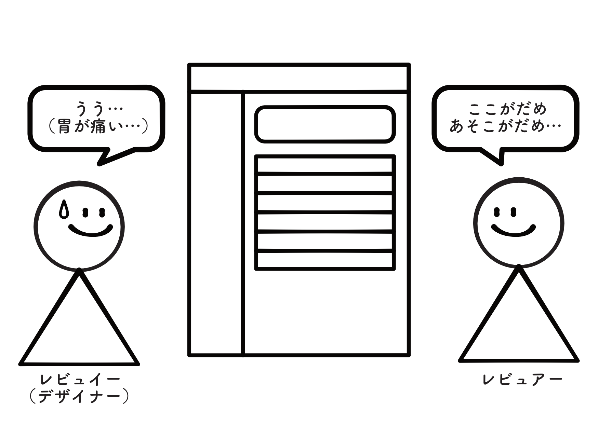
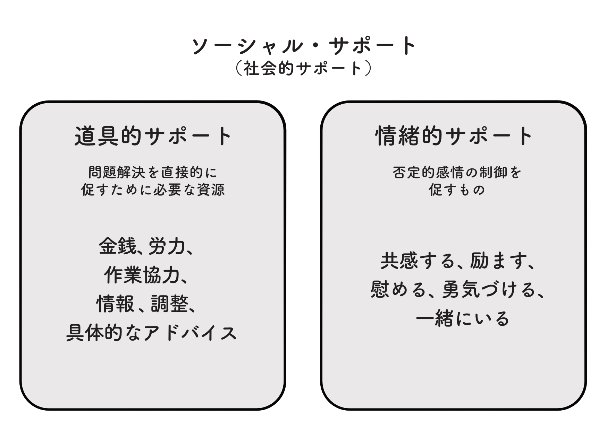
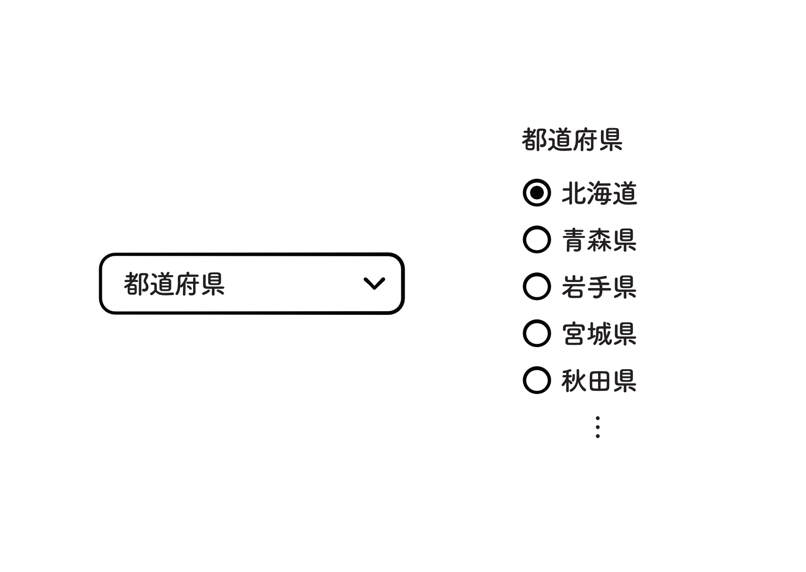

  
支援的デザインレビューの提案 ― ソーシャルサポートの観点から

  
奈良輪 夢美（@n__yumemi）

# 支援的デザインレビューの提案 ― ソーシャルサポートの観点から

デザインレビューは、プロダクト開発においてより良いUIおよびサービスの在り方を目指すための大事なプロセスのひとつです。プロダクトの品質向上だけでなく、デザイナー（レビュイー）が自分以外の視点を通じて、新たなスキルや知識を獲得する場でもあります。

しかし、これまでのデザインレビューでは、成果物を批判的な視点から見る必要があるため批評的・否定的な側面が強調されやすく、特にレビュイーにとって苦痛を感じる場になりやすいことが問題でした。  
加えて、レビュアーはレビュイーとのスキルや知識の差を埋めつつプロダクトの品質向上に寄与する指摘を行い、かつハラスメント問題に発展しないよう十分に配慮する必要もあり、レビュアーにとっても難しい業務です。

最近では、心理的安全性の概念が注目され、生産性向上や組織内での協働を促す要件として重視されるようになってきました。また、組織を越境し業界全体でデザイナーを育成していくという意味でも、デザインのあらゆるプロセスでの心理的安全性は重要です。

そこで、これまでの批評的なデザインレビューから、より支援的なデザインレビューを目指して、ソーシャルサポート（社会的支援）の観点から新しいデザインレビューの手法を検討します。

## これまでのデザインレビュー

デザインレビューは、だいたい次のような流れで進められます。まず、デザイナーがデザインを制作し、次にそのデザインについてレビューを依頼します。依頼を受けたレビュアーは、成果物を確認し、改善のための指摘を行います。最後に、レビュイー（デザイナー）がフィードバックを取り入れ、デザインに反映します。この一連のサイクルが、プロダクトの品質向上やデザイナーの成長につながっていきます。

デザインレビューにおける指摘としては、次のような内容が典型的です。

- 全体的な情報設計が十分でない
- プラットフォームのガイドラインに従っていない
- 目的に対して適切なコンポーネントを使用していない
- 想定ユーザーにとってのユーザビリティが不十分である
- 想定ユーザーにとってのアクセシビリティが不十分である
- デザインシステムを正しく使用できていない
- 直近の議論や検討内容が反映されていない

さらに、デザインレビューには避けるべきアンチパターンも存在します。例えば、抽象的・示唆的でレビュイーがデザインに反映できないような指摘、成果物やレビュイー（デザイナー）本人を否定してしまうケース、地位や人間関係の優位性を背景に一方的に従わせるような振る舞いです。これらはプロダクトの品質向上に対して意味がないばかりでなく、デザイナーの就業環境を害します。

また、現場の状況によっては指摘が実際のデザインに反映されることなく終わってしまうこともあります。こういった場合、レビューの意味がなく、次第にレビューが形骸化してしまいます。

このように、従来のデザインレビューには一定の有効性がある一方で、運用の仕方によってはデザイナーやチームの成長を妨げるリスクも少なくありません。

## 支援的デザインレビューの提案
### マインドセット

これまでのデザインレビューは、成果物に対する批評や修正の指示に重点が置かれがちでした。しかし、支援的なデザインレビューでは、レビューの目的を「デザインを修正させること」ではなく「レビュイー（デザイナー）を助けること」として捉え直します。

たんに「エラー状態のテキストフィールドには Schemas/Error を使ってね」という指摘では、レビュイーは個別具体についてしか学べません。指摘の粒度はレビュイー（デザイナー）のスキルレベルに応じるため、難しいところではあります。しかし、レビュイーによっては「エラーには赤色を使う」というふうに丸暗記してしまい、別の状況で似たようなミスを繰り返してしまうかもしれません。

支援的なデザインレビューでは、レビュイーがなぜカラースキームを適用できなかったのかを聞き、レビュイーの疑問を解消しながら、カラースキームの正しい使い方について情報提供します。
レビュイーが指摘の意味を本質的に理解し、レビューで得られた知識を自分のものとして落とし込み、自分自身で気付けるようになることが、プロダクトやチーム全体にとって大きな価値になります。

そして、この支援の枠組みを考える上で参考になるのが、心理学における「ソーシャルサポート（社会的支援）」の考え方です。

### ソーシャルサポートとは

ソーシャルサポートとは、1970年代に心理学者 G.キャプランおよび J.キャッセルによって提唱された概念であり、専門家ではない周囲の人々から提供される支援の総称です。この枠組みでは、支援は大きく二種類に分類されます。  
一つは、問題解決に必要な物資や情報を提供する「道具的サポート」、もう一つは、感情をケアし、共感や励ましを通じて相手を支える「情緒的サポート」です。

この二種類のサポートは、実務的なデザインレビューにおいても適用できます。次に、レビューにおいて、それぞれが具体的にどのように機能するかを整理します。

### デザインレビューにおけるソーシャルサポート

#### 道具的サポート

- 具体的な課題点の一つずつに対して、参照すべきガイドラインやデザインシステムを示す
- より適したコンポーネントやスタイルを提案する
- デザインシステムに従っていない場合は、そうした事情や意図を尋ね、レビュイーの判断に資する情報を提供する
- レビュイーが興味や課題感を持つ領域について、役立ちそうな情報やリソースを提供する

#### 情緒的サポート

- デザインしてくれたこと、レビューを受けてくれたことに対して感謝を伝える
- 一目見て良いと感じた点、優れている点を言葉にして伝える
- デザインにおいて困難だった点や悩んだ点を尋ね、レビュイーの努力や思考に共感し、認める
- レビュー後には「指摘は理解しやすかったか」「実行できそうか」を確認し、反映作業に向けて勇気づける

　このように、デザインレビューをソーシャルサポートの観点をもって実践することで、たんなる批評や指摘の場ではなく、レビュイーの成長に寄与し、チームの相互支援を促進する場にしていけるでしょう。

## 実践的アプローチ

ここからは実践的なアプローチ方法を紹介します。例えば、レビュイーがなぜそのコンポーネントを選んだのかわからないことがあります。そういうときは、まずレビュイーにどういうふうに考えてそのコンポーネントを選択したのかをヒアリングすることからはじめます。

具体例として、セレクトメニューのほうが適していそうな場面でラジオボタンを使用している場合があったとします。複数の選択肢から一つを選ぶUIコンポーネントとして、セレクトメニューとラジオボタンとの使い分けは微妙です。  
ユーザーにとってどんな選択肢があるか予想がつくならセレクトメニュー、そうでないならラジオボタンという判断基準でもよいでしょう。

レビュイーに、なぜラジオボタンを使用しているのかを聞いたうえで、セレクトメニューでも良さそうなのに、セレクトメニューではだめなのかを聞いてみます。  
そこでレビュイーがはっきりと理由を答えられなくても、無理にセレクトメニューを勧めないようにします。レビュイーが、セレクトメニューのほうが適しているかもしれないと気づくだけで十分だからです。

## 指摘の仕方

### 否定しない

指摘をするときは、デザインを直させることが目的ではないので、問いかけや提案の形を取るようにしましょう。レビュイーの考えや主義、仮説を否定しないようにします。たとえレビュイーの思い込みであっても、否定するのはレビューの目的ではありません。

### 具体的に指摘する

また、抽象的なアドバイスは避け、具体的かつ現実的な方法を提案しましょう。「ちゃんとデザインガイドラインを読んでください」とか「ゲシュタルトの法則を学んできてください」と言うのは、「そんなことも知らないのか」と言っているのと同じです。  
より具体的に、「余白が揃っていると情報のレベルが同じだと感じられるので、カードの間は16pxにして同じ感覚で繰り返しましょう」というように指摘します。

### 言いたいことは10個のうち1個

もし指摘したいことが10個あったら、そのうちレビュイーにとってもっとも役に立つ1個だけを指摘しましょう。デザインを直させることが目的ではないので、レビュアーの気になった点すべてを指摘する必要はありません。それよりも、どこを指摘するとレビュイーにとって最良のレビューになるかに気持ちを向けましょう。

最後に私がよく使うテクニックを紹介して終わりにしたいと思います。

## レビュアーのためのテクニック
指摘のうち特に難しいのが、デザインやレビュイーの考え方全体について指摘したほうがよいと思われる場合です。そういうときは、レビュイーと成果物との関係性をより重要視する必要があります。「成果物に対して言っているのであって、レビュイーに対して言っているのではない」という前置きや暗黙の了解は、レビュアーの指摘を無条件に正当化し、レビューの意味を失わせます。

そもそもデザイナーとデザインは分かちがたく結びついており、分けることは困難です。それよりも、デザイナーとデザインを同じくらいリスペクトするほうが簡単です。そこで使えるフレーズを2つご紹介します。

### 「〇〇さんの（ポジティブな点）が、出過ぎちゃっている」
これは、レビュイーの手癖や好み、素晴らしい性質が、デザインの中に見て取れるときに使いやすいフレーズです。レビュイーのポジティブな点を取り上げることで、批判的な指摘を受け入れやすくします。

- 〇〇さんの丁寧さがすごく表れていますね。そして、その丁寧さが出過ぎちゃっていて、余白が大きすぎるところがあるかもしません。  
- 全体的に優しい印象なのが素敵ですね。その代償として、コントラスト比が弱いところも多いですね。〇〇さんの優しさが、出過ぎちゃっているのかもしれませんね。

### 「〇〇さんがすごく悩んだのを感じる」
レビュイーの悩みが芯を食っているときに効果的なフレーズです。特に、悩んだ結果、惜しいデザインになっている場合に、さらにステップアップする指摘をしたいときに使えます。（実際には悩んでいなくとも）共感から入ることで、納得感のある指摘につなげやすくなります。

- この画面遷移に〇〇さんの悩ましさを感じます。ハイブリッドアプリだから、余計に悩みましたか？
- 情報設計に悩まれたのではないかなと思いました。ユーザーがサイトを初めて使うときと同じくらい、サイトを何回も使うことを考えてレイアウトしないとですね。

## まとめ
本稿では、従来の「批評的なデザインレビュー」を「支援的なデザインレビュー」へと転換する視点を示しました。それは、レビューの目的を「デザインを直させること」ではなく「レビュイーを助けること」と捉え直すことです。

そのためには、道具的サポートとして具体的な情報やツールを提供すること、そして情緒的サポートとして感謝や共感を伝えることの両輪が重要です。特に、デザイナーが一人でデザインしているだけでは突破できないような悩みに対して、客観的な視点から示唆することが大きな学びにつながります。

支援的デザインレビューは、単なる成果物の改善にとどまらず、チームの心理的安全性を高め、デザイナーとデザイン組織の成長を後押しする場になります。ぜひ、明日から支援的デザインレビューをしてみませんか？

## 参考文献
- 森 津太子. 社会・集団・家族心理学. 第2版, 一般財団法人 放送大学教育振興会, 2020