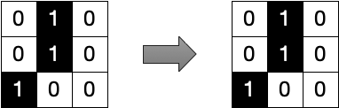
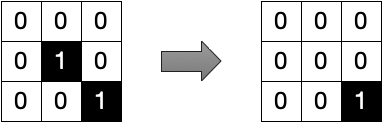
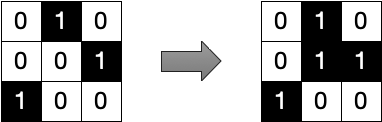
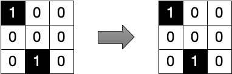
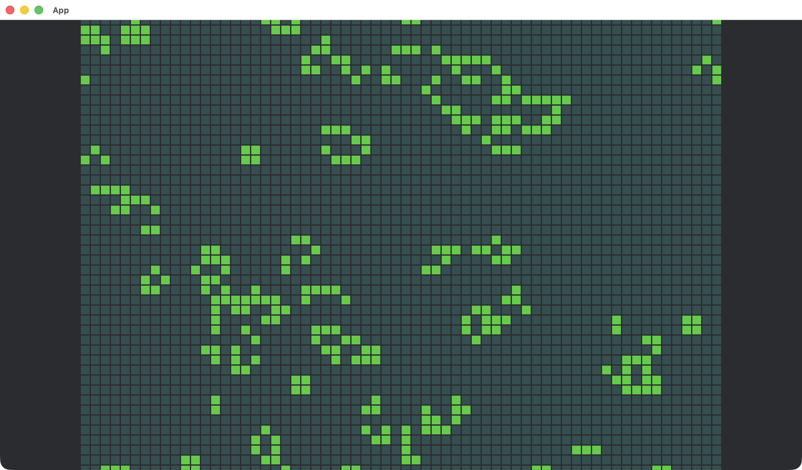

  
Rust Bevy を使った数理シミュレーション実装に AI エージェントを活用する

  
宇佐見公輔

# Rust Bevy を使った数理シミュレーション実装に AI エージェントを活用する

Rust 言語でゲーム制作をおこなうフレームワーク Bevy を使って、数理シミュレーションの実装を考えます。Bevy については前回の『ゆめみ大技林 '25』[^daigirin25]で紹介しましたので、ぜひご覧ください。

[^daigirin25]: 『ゆめみ大技林 '25』<https://yumemi-inc.booth.pm/items/7003494>

## AI エージェントの活用

GitHub Copilot や ChatGPT の登場以降、プログラミングに AI を活用するのは当たり前になってきました。

AI の活用のしかたはさまざまです。分からないことを AI に聞く、既存コードの調査を AI にさせるなど、開発作業をサポートしてもらう。AI にコードレビューをしてもらう。AI に指示して実装コードやテストコードを生成してもらう。さらには AI に実装のほとんどをまかせる。最近は Vibe Coding という言葉も使われるようになりました。

今回は AI エージェントの活用を考えていきます。

プログラミングの AI エージェントとしては、Claude Code が優秀なことで有名です。また、Cursor のエージェントモードも優秀です。これらは筆者も業務で活用しています。今回はそれ以外も試してみようと考えて、JetBrains Junie（ジュニー）を利用してみました。

## 開発環境と AI

Rust 言語で個人的に好きな点として、エコシステムが分かりやすく整っているという点があります。開発環境の整備が楽でよいです。

IDE には JetBrains の RustRover を使っています。また、AI Pro のライセンスも所有していて、RustRover に JetBrains AI アシスタントと JetBrains Junie をインストールしています。AI アシスタントはチャットでのやり取りや簡単な編集の機能、Junie は自律的に動作する AI エージェントです。JetBrains で揃えると IDE と AI がいい感じに統合されるのが好みです。JetBrains AI が登場した最初のころは性能がそれほど高くない印象もありましたが、現在は十分な性能をもつと感じます。

## 実装するもの

筆者は以前から、数理シミュレーションを Bevy を使って実装できたらよいな、という考えを持っていました。しかし、その実装方法についてそれほど詳しいわけではありません。そこで AI エージェントに助けを借りて、いくつかの題材を試しました。

今回の記事では、セルオートマトン、特に Conway のライフゲームを取り上げます。

セルオートマトンとは、物理現象などを計算機で研究するための手法のひとつです。空間（1 次元、2 次元、3 次元）の中で格子状にセルが配置されます。それぞれのセルは有限個の状態をとります。セルの状態は特定の時間間隔で更新されます。セルの新しい状態は、そのセル自身とセルの近傍の状態を参照して特定のルールに基づいて決まります。

Conway のライフゲームは、セルオートマトンの一種です。2 次元平面の中で格子状に配置されたセルを考えます。セルの状態は 0（消灯）か 1（点灯）のどちらかです。セルの近傍として、上下左右斜めの 8 個を参照します。セルの状態更新は次のルールで決まります。

- 点灯しているセルについて、近傍に点灯セルが 2 つか 3 つの場合、次も点灯
- 点灯しているセルについて、近傍に点灯セルが 1 つ以下か 4 つ以上の場合、次は消灯
- 消灯しているセルについて、近傍に点灯セルが 3 つの場合、次は点灯
- 消灯しているセルについて、近傍に点灯セルが 2 つ以下か 4 つ以上の場合、次も消灯

  

    
    点灯セルの近傍に点灯セルが 2 つ → 次も点灯
  

  

    
    点灯セルの近傍に点灯セルが 1 つ → 次は消灯
  

  

    
    消灯セルの近傍に点灯セルが 3 つ → 次は点灯
  

  

    
    消灯セルの近傍に点灯セルが 2 つ → 次も消灯
  

## AI エージェントへの指示の出しかた

AI エージェントに実装をまかせるため、どんな指示を出すかを考えます。

最初は手作業で、cargo コマンドで新規プロジェクトを作成します。実のところ Claude Code のような CLI 型のツールであれば、新規プロジェクト作成も AI エージェントにまかせることができます。しかし今回は JetBrains Junie を活用する都合上、先にプロジェクトを作成して IDE で開いておく必要があります。

その後は実装内容の指示です。これは次の 2 点をおさえればよいです。

- Bevy フレームワークを使うこと
- Conway のライフゲームを実装すること

Conway のライフゲームはプログラミングの題材としてよく知られています。そのため、先ほど述べたルールを細かく伝える必要はありません。「Conway のライフゲームを実装して」といえば通じます。今回の題材はこの点で楽です。

試しに、Bevy で Conway のライフゲームを実装してと指示して AI エージェントに実装コードを生成させてみました。すると、それっぽいコードを生成して、できましたと返してきました。ところが、ビルドに失敗する不完全なコードでした。どうやら AI は実際にビルドせずに、できたと返事を返してきたようです。

ここが最初の注意点で、AI はビルド確認をしてくれない場合が多いです。ビルドして確認するように、明示的に指示を出すことをお勧めします。なお、Bevy のプロジェクトは cargo でクレート（ライブラリ）を大量にインストールする必要があるので、初回ビルドに時間がかかります。そのため、AI エージェントの実行前に、Bevy をプロジェクトに追加して初回ビルドしておくとよいでしょう。

さて、AI にビルド確認をさせると、ビルドエラーを見てコードを修正してくれました。そして、ビルドが通る状態のコードを生成して、できましたと返してきました。実行してみると、理想的とはいえないにしても動作しているようです。ひとまずは、これでライフゲームの実装という目的は達成できたようです。

ただ、何度か生成を試しましたが、どうやら Bevy の古いバージョンが使われてしまいます。あらかじめ Bevy の最新バージョンを cargo で追加しておいても、AI がわざわざ古いバージョンに変えてしまいます。また、最新バージョンを使えと指示しても、指示どおりに生成できません。

ここがもうひとつの注意点で、Bevy の最新バージョンを活用したコードをうまく生成できません。おそらくは、AI が学習しているコードが古いバージョンのものなのでしょう。Bevy はまだ安定版ではなく、バージョンアップのときに互換性のない変更がたびたび発生します。古いバージョンで動作していたコードでも、最新バージョンではビルドできないことがたびたびあります。AI は最新バージョンに対応したコードの書きかたが分からず、代わりに古いバージョンを採用するという対処法を取りがちなようです。

そのこと自体がただちに悪いわけではありませんが、望ましいともいえません。

## 望ましい出力を得るために参照情報を与える

Bevy の最新バージョンを活用したコードを AI に生成させるにはどうすればよいでしょうか。

まず、参照してほしいドキュメントや記事を指定します。今回は、筆者が書いた次の記事を情報源として渡しました。

- Rust Bevy によるクリエイティブコーディング[^rust-bevy]

[^rust-bevy]: Rust Bevy によるクリエイティブコーディング <https://zenn.dev/usamik26/articles/bevy-creative-coding>

この記事には、執筆時点での最新である Bevy 0.16.1 で正しく動作するサンプルコードが記載されています。そのため、古い Bevy のサンプルコードに惑わされにくくなります。

さらに、AI に渡す新規プロジェクトで、この記事のサンプルコードのひとつを入力してビルドしておきました。こうすることで、すでに最新の Bevy で動くコードがある状態からのスタートにできます。

これらの対策を実施すると、AI が最新の Bevy で動くライフゲームの実装コードを生成してくれるようになりました。

自分が書いた記事を参照させたわけですが、技術記事を書いて公開しているとこういうときに役に立ちますね。また自分の記事には、特に意図していなくても自分の個性や好みが反映されがちです。それを参照させることで、生成結果に自分の好みが反映されることもある程度は期待できます。何度か試した範囲では、参照記事がないときよりは自分にとって読みやすいコードが生成される傾向にありました。

## でき上がった画面

生成されたアプリの一例を示します。

このとき生成されたアプリの例では、セルの初期配置がランダムに決定され、自動的にライフゲームのステップが進みます。また、スペースキーで一時停止・再開ができる機能、カーソルキー上下で速度アップ・ダウンができる機能もあります。これらの仕様は細かく指示していませんでしたが、AI が自律的に判断して組み込んでいました。

## コードを改善する

コードを生成させて終わりではなく、それをさらに改善することを考えましょう。

ここまでにできあがったものを一度保存しておきます。Git リポジトリにコミットしておくのが分かりやすいでしょう。こうしておくことで、コードに手を入れた結果が気にくわなくても、簡単に変更を破棄して元の状態に戻せます。いったん動くものをつくり、それから改善する、という段階を踏むのが大事です。

改善のためには、一度 AI エージェントを終了して、新しい AI エージェントを起動します。そして、現在のコードを改めて読ませます。これは個人的な意見ですが、生成時の AI エージェントをそのまま利用し続けるよりも、一度リセットしたほうがよい改善をしてくれる傾向がありそうです。

何をどう改善するか考えます。この段階では、自分でも考えつつ AI の助けも借りる、というのがよいバランスではないでしょうか。AI にコードを読ませて意見をもらいつつ、自分でも実際のコードを読みます。おそらくこの時点では、読みにくいコードも多くあります。読みにくいと感じた点は、つまり改善すべき点です。

改善したい点を AI に伝えて、具体的な改善案を考えてもらいます。あるいは、実際に改善案を適用してもらいます。その改善がよいものならば採用し、あまりよくなければ不採用として破棄します。せっかく提案してくれた内容を不採用にするのは悪い気もしますが、それでも遠慮なく不採用にして何度も繰り返しトライできるのは、AI 活用のよいところだと考えています。

今回の題材では、ECS アーキテクチャをあまり有効活用していないコードが生成されていると感じたので、ECS っぽくできないかと何度かトライしてみました。ただ、Conway のライフゲームは構成要素がシンプルすぎて、ECS に適合させようとこだわりすぎてもよくないようでした。この題材だと、アーキテクチャよりも、局所的なコードの書きかたを整えるほうが読みやすくなりました。

また、Conway のライフゲームに特化したコードが生成されていると感じたので、他のセルオートマトンにも対応しやすいコードにできないかと何度かトライしてみました。ただ、あまり汎用性にこだわりすぎると、ルール設定のコードが複雑化してよくないようでした。それよりも、別のルールを実装したいときに変更箇所を少なくおさえられるようなコードに整えるほうが読みやすく、応用もきく形になりました。

改善のトライの繰り返しのおかげで、指示する人間に知見がたまるのはよいですね。

## おわりに

今回は Rust Bevy と AI エージェントの活用事例を紹介しました。考えかたの話が中心で、具体的な細かい知見にはあまり触れることができませんでしたが、引き続き活用を模索していこうと考えています。
